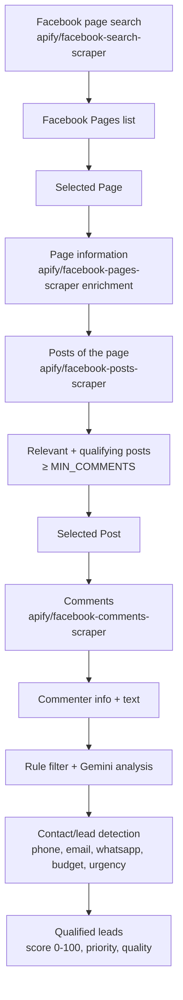
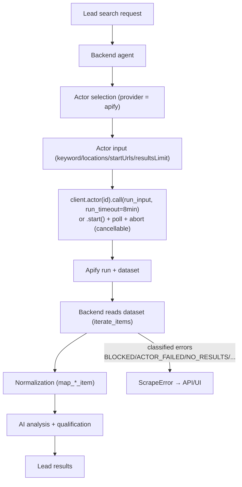
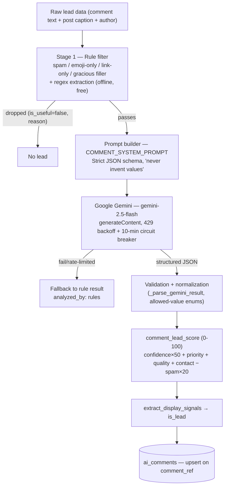
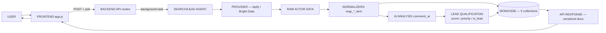

# LeadAI — AI-Orchestrated Social Lead Intelligence Platform

An AI-powered lead generation platform that interprets a natural-language search request, finds real social-media business pages (primarily Facebook) through **Apify** actors, drills down into their posts and comments, and uses a **rule-based + Google Gemini** pipeline to extract, qualify and score high-intent leads — served through a FastAPI REST API with a browser dashboard.

Say **"property dealers in jaipur"** and the platform:

1. Parses your intent (keyword / city / state / category),
2. Searches real Facebook pages via the Apify `facebook-search-scraper`,
3. Enriches page details (contacts, about, photos) via `facebook-pages-scraper`,
4. Auto-collects posts and the top comments of every page,
5. AI-analyzes each comment for phone, email, WhatsApp, budget, requirement, urgency and intent (buying / selling / rent / investment / other),
6. Scores leads 0–100 with a deterministic rank, and lets you export pages, posts and leads as CSV.

You can also paste a **Facebook page, Instagram profile, YouTube channel or LinkedIn company URL** and get the same page → posts → comments → leads pipeline for that single target.

> **Stack:** FastAPI · MongoDB (Motor + PyMongo) · Apify actors · Google Gemini (optional — rule-based fallback) · Bright Data (alternative provider) · Vanilla JS UI · Docker

---

## Table of Contents

- [1. Project Overview](#1-project-overview)
- [2. Key Features](#2-key-features)
- [3. Technology Stack](#3-technology-stack)
- [4. System Architecture](#4-system-architecture)
- [5. Folder Structure](#5-folder-structure)
- [6. End-to-End Workflow](#6-end-to-end-workflow)
- [7. Facebook Lead Intelligence Workflow](#7-facebook-lead-intelligence-workflow)
- [8. URL-Based Lead Search Workflow](#8-url-based-lead-search-workflow)
- [9. Lead Data Model](#9-lead-data-model)
- [10. API Architecture](#10-api-architecture)
- [11. Apify Architecture](#11-apify-architecture)
- [12. AI Architecture](#12-ai-architecture)
- [13. Data Flow](#13-data-flow)
- [14. Error Handling](#14-error-handling)
- [15. Environment Variables](#15-environment-variables)
- [16. Installation](#16-installation)
- [17. Running the Project](#17-running-the-project)
- [18. Example Lead Search](#18-example-lead-search)
- [19. Search by Page / Social URL](#19-search-by-page--social-url)
- [20. Cost and Resource Usage](#20-cost-and-resource-usage)
- [21. Security](#21-security)
- [22. Performance](#22-performance)
- [23. Logging and Monitoring](#23-logging-and-monitoring)
- [24. Testing](#24-testing)
- [25. Troubleshooting](#25-troubleshooting)
- [26. Security & Privacy Considerations](#26-security--privacy-considerations)
- [27. Current Implementation Status](#27-current-implementation-status)
- [28. Future Improvements](#28-future-improvements)
- [29. Developer Guide](#29-developer-guide)
- [30. Git Workflow](#30-git-workflow)
- [31. Architecture Summary](#31-architecture-summary)

---

## 1. Project Overview

### The problem

Businesses that sell high-value products (real estate, automobiles, interior design, wedding services, etc.) need a constant stream of qualified buyers. Facebook is full of buying signals — business pages post offers and interested people comment with phone numbers, budgets and urgent requirements. Manually reading thousands of comments is impossible.

### What LeadAI does

LeadAI automates the whole funnel:

- **Understands what you want** — a free-text query such as *"property dealers in kota rajasthan"* is parsed into `{keyword, city, state, category}` by offline dictionaries with a Gemini fallback (`app/agent/intent.py`).
- **Finds real pages** — the intent is handed to Apify actors (or Bright Data) that perform the actual fetching. The AI agent never scrapes Facebook itself and never fabricates data — every stored value comes from real actor output.
- **Scores pages** — for every page, posts are collected and qualified: a post is *relevant* when its text mentions the query's keyword/location, and *qualifying* when it also has at least `MIN_COMMENTS` (default 10) Facebook-reported comments. Pages get a deterministic `lead_score` from qualifying-post volume, comment volume and posting recency/activity.
- **Finds leads in comments** — comments on qualifying posts are collected and passed through a two-stage pipeline: a free, offline rule stage (filters filler/spam, regex-extracts phone/email/whatsapp/budget/location/urgency) and an optional Gemini stage (rich extraction of contact info, person context and buyer signals). Every lead gets a 0–100 `lead_score`, a priority (high/medium/low), a lead quality (hot/warm/cold) and a value list of `is_lead` display signals.
- **Presents and exports** — a live dashboard lets you drill pages → posts → comments → lead cards, and export any level as CSV.

### What makes it different from a simple scraper

- Deterministic, explainable **qualification logic** (relevance tokens + comment-count threshold) instead of dumping everything.
- **Two providers** behind one interface (Apify + Bright Data), switchable per search.
- **AI analysis with a rule-based fallback** — the product works end-to-end even without a Gemini key.
- **Classified errors** — failures are labeled (`BLOCKED`, `ACTOR_FAILED`, `NO_RESULTS`, `ACCESS_DENIED`, ...) with run/dataset ids, so "no results" is never mistaken for a block.
- **Cancellable, resumable background jobs** with live status persisted in MongoDB.

### Who it is for

Sales teams, agencies and lead-generation businesses focused on Indian markets (the built-in city/state dictionaries cover major Indian cities) that want qualified buyers/sellers from Facebook conversations.

---

## 2. Key Features

Status legend: ✅ Implemented · 🟡 Partially Implemented · ⬜ Planned

| Feature | Status | Where |
| --- | --- | --- |
| AI intent parsing (keyword/city/state/category) | ✅ | `app/agent/intent.py` |
| Keyword-based Facebook page search | ✅ | `POST /api/search` → `apify/facebook-search-scraper` |
| Location-aware search (city/state) | ✅ | intent → `locations` input of the search actor |
| Facebook page detail extraction (followers, likes, category, about, phone, email, website, address, photos, verified) | ✅ | `apify/facebook-pages-scraper` + `merge_page_details` |
| Facebook post collection (caption, images, videos, links, likes, comments, shares, date) | ✅ | `apify/facebook-posts-scraper` |
| Facebook comment collection (text, author, profile URL, date, reactions) | ✅ | `apify/facebook-comments-scraper` |
| Contact-info flagging (10-digit phone / email in comment) | ✅ | `has_contact_info` in `app/pipeline/comment_ai.py` |
| Rule-based comment screening (spam / filler / emoji / link-only) | ✅ | Stage 1 of `comment_ai.py` |
| Gemini comment analysis (contacts, budget, requirement, intent, urgency, quality) | ✅ (needs `GEMINI_API_KEY`) | Stage 2 of `comment_ai.py` |
| Buyer/seller/other intent classification | ✅ | Gemini `lead_type` + rule path (`buying` intent) |
| Lead quality (hot/warm/cold) and priority (high/medium/low) | ✅ | Gemini + `comment_lead_score` |
| Deterministic 0–100 lead score | ✅ | `comment_lead_score` in `comment_ai.py` |
| Page lead ranking (qualifying posts, comments, activity) | ✅ | `_lead_score` in `app/agent/search.py` |
| Post qualification (relevant + ≥ MIN_COMMENTS) | ✅ | `_is_qualifying_post` |
| Duplicate removal (unique URLs per run, unique comment analysis) | ✅ | Mongo unique indexes |
| CSV export (pages / posts / leads) | ✅ | `GET /api/export/*.csv` |
| MongoDB persistence (5 collections) | ✅ | `app/db/` |
| Search history | ✅ | `GET /api/search/history` |
| Run cancellation (aborts in-flight Apify run) | ✅ | `POST /api/search/{run_id}/cancel` |
| Auto-pipeline per run (collect posts + top comments with no clicks) | ✅ | `collect_run_posts` |
| URL-based search: Facebook / Instagram / YouTube / LinkedIn | ✅ | `POST /api/url/search` |
| URL search report page | ✅ | `/static/url_report.html` |
| Bright Data as an alternative Facebook provider | ✅ | `app/connectors/brightdata_connector.py` |
| Live progress polling (UI progress bar + status fields) | ✅ | `app.js` `pollSearchRun` |
| Post comment-scrape skipping under the threshold | ✅ | `collect_post_comments` status `skipped` |
| Lead detail view (comment + post + page context) | ✅ | `GET /api/comments/{id}` + modal |
| Page filters (category / city / name / has-contact) | ✅ | `GET /api/pages` |
| Comments filter (contact-only / leads-only) | ✅ | `GET /api/posts/{id}/comments` |
| Authentication / user management / multi-tenancy | ⬜ | Not implemented — single-user, open API |
| Rate limiting (API level) | ⬜ | Not implemented (provider-side 429s are handled) |
| Webhooks / background job queue / analytics | ⬜ | Not implemented — background tasks are in-process |
| Export to Excel/Sheets/CRM | ⬜ | CSV only |
| More social platforms (Twitter/X, Pinterest, etc.) | ⬜ | Only FB/IG/YT/LinkedIn URL search exists |

---

## 3. Technology Stack

| Layer | Technology | Purpose |
| --- | --- | --- |
| Frontend | Vanilla HTML5 / CSS3 / JavaScript (no framework, no build step) | Dashboard: search, pages, posts, comments, lead cards, CSV export |
| Backend | FastAPI + Uvicorn (Python) | REST API, static hosting, background task orchestration |
| Programming Language | Python 3.11+ (Docker image `python:3.11-slim`) | Entire backend |
| AI Model | Google Gemini `gemini-2.5-flash` (configurable) | Intent parsing fallback + comment analysis |
| AI Access | REST `generativelanguage.googleapis.com/v1beta` via `httpx` | No SDK dependency |
| Scraping #1 | Apify (official `apify-client`) — 4 Facebook actors + configurable IG/YT/LinkedIn actors | All social data collection |
| Scraping #2 | Bright Data Facebook Scraper API (Discover + datasets) | Alternative Facebook provider |
| Database | MongoDB (`mongo:7` in Docker) — Motor (async) for API handlers, PyMongo (sync) for background threads | Persistence of pages/posts/comments/analysis/history |
| API | REST (FastAPI), docs at `/docs` (Swagger UI) | All product surface |
| Authentication | None (not implemented) | — |
| Configuration | `pydantic-settings` reading `.env` | All settings |
| Deployment | Docker + docker-compose (API + Mongo) | Containerized run |
| Code quality | Ruff (lint) + mypy (type checks) | Dev workflow (caches in repo) |
| Testing | `pytest`-style acceptance tests + standalone integration check | `tests/` |

Key libraries (`requirements.txt`): `fastapi`, `uvicorn[standard]`, `pydantic`, `pydantic-settings`, `motor`, `pymongo`, `httpx`, `apify-client`.

---

## 4. System Architecture

```mermaid
flowchart TD
    U[User] --> FE[Browser Dashboard<br/>app/static: index.html + app.js]

    FE -->|"POST /api/search<br/>(query, limit, provider)"| API[FastAPI app.main:app]
    FE -->|"POST /api/url/search<br/>(social URL)"| API
    FE -->|"poll GET /api/search/{run_id}"| API
    FE -->|"POST/GET pages, posts, comments, export CSV"| API

    API --> DB[(MongoDB 'LeadAI'<br/>5 collections)]
    API -->|asyncio.to_thread / in-process task| AGENT[Lead Agent — app/agent/search.py]

    AGENT --> INTENT[Intent parser — app/agent/intent.py<br/>offline dictionaries + Gemini fallback]

    AGENT --> FACTORY[Provider factory — get_connector]
    FACTORY --> APIFY[ApifyConnector — app/connectors/apify_connector.py]
    FACTORY --> BDS[BrightDataConnector — app/connectors/brightdata_connector.py]

    APIFY --> A1[apify/facebook-search-scraper]
    APIFY --> A2[apify/facebook-pages-scraper]
    APIFY --> A3[apify/facebook-posts-scraper]
    APIFY --> A4[apify/facebook-comments-scraper]
    APIFY --> A5[Configurable actors<br/>instagram / youtube / linkedin]

    BDS --> BDD[Facebook Scraper API<br/>Discover + pages/posts/comments datasets]

    AGENT -->|normalize + dedupe| DB
    AGENT -->|"collect_post_comments"| CAAI[Comment AI pipeline — app/pipeline/comment_ai.py]
    CAAI -->|Stage 1: rule filter/regex| RULES[Rules — offline]
    CAAI -->|Stage 2: Gemini extraction| GEMINI[Google Gemini API]
    CAAI -->|upsert analysis| DB

    AGENT -->|auto-collection for the whole run| RUNPOSTS[collect_run_posts<br/>posts -> top qualifying comments]

    AGENT -->|"POST /api/url/search path"| URS[url_search.py + scrapers.py]
    URS --> UDET[URL detector — app/social/url_detector.py]
    URS --> APA5[Platform scraper (Facebook/Instagram/YouTube/LinkedIn)]
    URS --> DB

    API -->|"GET /api/url/search/{run_id}/report"| FE
```

### Components

- **`app/main.py`** — FastAPI application (v2.0.0). Sets up console (INFO) + file (DEBUG) logging, starts the Mongo index check at startup, mounts the static frontend, and exposes `/health`, `/`, `/dashboard`.
- **`app/api/routes/search.py`** — the entire REST surface. All long-running operations (`run_search`, `collect_page_posts`, `collect_post_comments`, `collect_run_posts`, URL search) run as **in-process background tasks** (`asyncio.create_task` + `asyncio.to_thread`); GET endpoints expose live status fields for polling. A `_tasks` registry prevents duplicate jobs for the same page/post/run.
- **`app/agent/search.py`** — the orchestrator ("the only brain between the user and Facebook"). Owns normalization (`map_page_item`, `map_post_item`, `map_comment_item`), relevance/qualification logic, page scoring, per-run dedupe, live `search_history` updates, and cancellation checkpoints.
- **`app/agent/intent.py`** — deterministic query parsing (Indian states/cities dictionary, category keyword map) with a Gemini fallback for missing pieces.
- **`app/connectors/apify_connector.py`** — thin wrapper over `apify-client` with classified error objects (`ScrapeError`), run timeouts, cancellation polling (`actor.start()` + `run.get()/abort()`), and request/response logging.
- **`app/connectors/brightdata_connector.py`** — same interface as the Apify connector; Discover API for page search, sync `/scrape` for page details, async `/trigger` + progress polling for posts/comments. All rows are normalized into Apify-shaped items so the agent's mappers are reused unchanged.
- **`app/pipeline/comment_ai.py`** — the lead-analysis brain: Stage 1 rule filtering + regex extraction, Stage 2 Gemini structured JSON extraction, `comment_lead_score` (0–100), `extract_display_signals` / `is_lead`, and persistence into `ai_comments`.
- **`app/social/`** — URL-search subsystem: `url_detector.py` (platform detection + canonicalization), `scrapers.py` (per-platform scraper classes over ApifyConnector), `url_search.py` (the background pipeline thread).
- **`app/db/`** — `mongo.py` (Motor + PyMongo clients, DNS override, index creation) and `models.py` (Pydantic models for all five collections).
- **`app/static/`** — `index.html` (dashboard), `app.js` (workflow state in `localStorage`, polling, rendering, exports), `styles.css`, `url_report.html` (standalone URL-search report page).

---

## 5. Folder Structure

```text
lead_apify/
├── app/
│   ├── main.py                  # FastAPI app, CORS, static mount, logging, /health
│   ├── config.py                # pydantic-settings: all .env-driven settings
│   ├── agent/
│   │   ├── intent.py            # query → {keyword, city, state, category} (+Gemini fallback)
│   │   └── search.py            # agent orchestrator: run_search, collect_page_posts,
│   │                            #   collect_post_comments, collect_run_posts, mappers, scoring
│   ├── api/
│   │   └── routes/search.py     # all REST endpoints + background task management
│   ├── connectors/
│   │   ├── apify_connector.py   # 4 Facebook actors + generic actor + classified ScrapeError
│   │   └── brightdata_connector.py  # alternative provider, same interface
│   ├── db/
│   │   ├── mongo.py             # async/sync clients, DNS override, ensure_indexes()
│   │   └── models.py            # Pydantic models: pages, posts, comments, ai_comments, history
│   ├── pipeline/
│   │   └── comment_ai.py        # rule filter → Gemini extraction → score → ai_comments
│   ├── social/
│   │   ├── url_detector.py      # detect+canonicalize FB/IG/YT/LinkedIn URLs
│   │   ├── url_search.py        # URL-search background pipeline (page→posts→comments)
│   │   └── scrapers.py          # platform scraper classes over ApifyConnector
│   └── static/
│       ├── index.html           # dashboard: search / pages / posts / comments views
│       ├── app.js               # polling, workflow memory, rendering, CSV exports
│       ├── styles.css           # all styling
│       └── url_report.html      # standalone report for URL-search runs
├── tests/
│   ├── test_qualification.py    # lead-qualification acceptance tests
│   ├── test_url_search.py       # URL detection/canonicalization + error classification tests
│   └── integration_check.py     # end-to-end pipeline check against a scratch Mongo DB
├── scratch/                     # dev-only diagnostic scripts (gitignored)
├── logs/                        # app.log (file logging, gitignored)
├── .env.example                 # template for environment variables
├── .gitignore
├── docker-compose.yml           # api + mongo:7
├── Dockerfile                   # python:3.11-slim image
├── requirements.txt
└── README.md
```

### Important files in detail

| File | Role in the workflow |
| --- | --- |
| `app/agent/search.py` | The single orchestrator. `run_search()` starts a keyword search; `collect_page_posts()` scrapes one page; `collect_post_comments()` scrapes + AI-analyzes one post; `collect_run_posts()` auto-runs the whole pipeline for a run. Also contains all normalizers (`map_*_item`) and scoring (`_compute_page_stats`, `_lead_score`). |
| `app/pipeline/comment_ai.py` | The only AI job. `analyze_comment_ai()` (rules → Gemini), `comment_lead_score()`, `extract_display_signals()`/`should_display_comment()`, `analyze_comments_for_post()` (batch, upserts `ai_comments`). Imported by both the keyword and URL search flows. |
| `app/connectors/apify_connector.py` | All Apify calls (`scrape_facebook_pages`, `scrape_facebook_pages_by_urls`, `scrape_facebook_posts`, `scrape_facebook_comments`, generic `scrape_actor`) with error classification. |
| `app/social/url_search.py` | Background URL-search pipeline: canonical URL → page details (with graceful fallback page doc) → posts → comments (FB/IG only) → AI analysis → same five collections. |
| `app/api/routes/search.py` | REST layer; the `_start`/`_background` helpers serialize jobs per key so a page's posts can't be collected twice. |
| `app/static/app.js` | Frontend workflow: search → poll run → open pages → open posts → open comments → lead modal; workflow memory persisted in `localStorage` (`leadai_run_id`, `leadai_page_id`, `leadai_post_id`). |

---

## 6. End-to-End Workflow

### Step 1 — User enters a search request

Two entry points on the Search screen:

- **Keyword search**: a free-text query (e.g. `property dealers in jaipur`), a page limit (1–100, default 10) and a provider toggle (**Apify** or **Bright Data**).
- **URL search**: a single social URL (Facebook page, Instagram profile, YouTube channel, LinkedIn company), plus a max-posts count (default 20).

### Step 2 — Request reaches the backend

The form POSTs to:

- `POST /api/search?query=&limit=&provider=` — validated by FastAPI (`query` 1–200 chars, `limit` 1–100, `provider` must match `^(apify|brightdata)$`). Bright Data is rejected with a 400 when its key is unset.
- `POST /api/url/search?url=&max_posts=` — `url` 4–300 chars; detected and canonicalized by `detect_social_url()`; invalid/unsupported URLs return 422 with an `errorType` (`invalid` | `unsupported`).

Both endpoints immediately persist a `search_history` document (`status: running`, `phase: queued`), generate a `run_id`, register a background task (`_start(...)`), and return immediately. No request ever blocks the API.

### Step 3 — Intent / search analysis

`parse_query()` (`app/agent/intent.py`) converts the free text into `{keyword, city, state, category, limit}`:

1. Cities and states are matched against offline dictionaries (`INDIAN_CITIES`, `STATE_NAMES` — longest name wins, case-insensitive).
2. Category is matched against `CATEGORY_KEYWORDS` (real estate, automobile, healthcare, interior design, wedding, restaurant, education, textile, electronics, travel, beauty).
3. If any of city/state/category is missing and a `GEMINI_API_KEY` exists, Gemini is asked (temperature 0.0, JSON mode) to fill the gaps.
4. `keyword` = the raw query with city/state words and trailing prepositions (`in`, `at`, `of`, ...) stripped — a better search term for Apify.

The parsed intent is stored on the `search_history` doc and shown as chips in the UI.

### Step 4 — Data source selection

`get_connector(provider)` (`app/agent/search.py`) is a **provider factory** — one interface, two backends:

- `apify` → `ApifyConnector` (default),
- `brightdata` → `BrightDataConnector` (requires `BRIGHTDATA_API_KEY`).

Each page/post/comment doc records its `provider` (default `apify`), so later drill-downs reuse the provider the page came from.

### Step 5 — Apify integration (keyword search)

`run_search()` calls `connector.scrape_facebook_pages(keyword, limit, locations=[city])`:

- The keyword is expanded into up to 3 variants (full query → last 2 words → last word) and tried in order.
- Each variant runs `apify/facebook-search-scraper` with `{categories: [variant], locations: [city], resultsLimit: limit}`.
- Successful runs return raw dataset items; empty results are reported as `NO_RESULTS` (never guessed as a block); failures are classified via `ScrapeError`.
- Then `apify/facebook-pages-scraper` is run once with `startUrls` for the stored pages (up to 30) to enrich missing details (verified, email, phone, about, photos) — `merge_page_details()` fills only fields that are still empty, never overwrites.

### Step 6 — Raw data collection

From the search actor: page **ID, name, URL, category, followers, likes, verified, phone, email, WhatsApp, website, address, city/state/country, profile/cover photos, about** (whatever the actor actually returned — absent fields stay `None`, never fabricated).

From the posts actor (per selected page): **post URL/ID, full caption, images, videos, external links, published date, likes, Facebook-reported total comment count, shares** — plus computed `is_relevant` and `is_qualifying` flags.

From the comments actor (per qualifying post): **comment ID/URL, author name, author profile URL, text, published date, reactions**, plus a computed `has_contact` flag (10-digit phone or email present).

### Step 7 — Data cleaning and normalization

Raw actor items are mapped to the internal document shapes by `map_page_item` / `map_post_item` / `map_comment_item`:

- Robust field resolution across actor naming variants (`_first(...)`, e.g. `facebookUrl | pageUrl | url | link`).
- Numeric parsing that handles `"1.2K"`, `"3L"`, `"2.5 Cr"` style strings (`_as_int`).
- Comment counts normalized from int / `"1.2K"` / nested `{count|total}` wrappers / preview lists (`_comment_count`).
- Page-name cleanup (the search actor puts `"Name | City"` in `title`), junk URL filtering (maps/instagram/whatsapp links are not stored as websites), page-vs-group detection from the URL.
- The Bright Data connector normalizes its rows into the *same Apify item shapes* so the same mappers are reused.

### Step 8 — AI processing

Two places use Gemini:

1. **Intent parsing** (`app/agent/intent.py`, `_gemini_intent`) — fills missing city/state/category; strict-JSON prompt, temperature 0.0; on failure the offline dictionaries' result is kept.
2. **Comment analysis** (`app/pipeline/comment_ai.py`) — every comment of a collected post goes through **Stage 1 (rules, free, offline)**: emoji-only / link-only / spam-pattern / gracious-filler comments are dropped with a `reason`, and phone/email/WhatsApp/website/budget/location/urgency/buying-intent are regex-extracted. Comments that pass Stage 1 go to **Stage 2 (Gemini)**: the system prompt (`COMMENT_SYSTEM_PROMPT`) demands strict JSON with `is_useful`, `lead_type` (buyer/seller/broker/other/none), `confidence_score`, `priority`, `lead_quality` (hot/warm/cold), `sentiment`, `spam_score`, `duplicate_score`, `contact` (phone/mobile/whatsapp/email/telegram/website/instagram/facebook_profile), `person` (city/state/country/language/occupation) and `buyer` (budget/requirement/property_type/service_needed/preferred_location/timeline/urgency/intent). Gemini is explicitly told to **never invent values**. A 429 circuit breaker skips Gemini for 10 minutes; any failure or missing key falls back to the rule result with `analyzed_by: "rules"`.

The nested Gemini response is flattened (`_flat_extract`) into display-ready fields on `ai_comments`, and `analyzed_by` records which path produced the data.

### Step 9 — Lead qualification

- **Post level**: `is_relevant` = the caption mentions any token from the search keyword or the page's city/state; `is_qualifying` = relevant **and** `total_comment_count >= MIN_COMMENTS` (default 10; set `MIN_COMMENTS=0` to disable).
- **Page level** (`_page_activity` + `_lead_score`): activity = `active` (post ≤ 90 days), `recent` (≤ 365), `inactive`, `unknown`; `lead_score = qualifying_posts*5 + total_comments_on_qualifying (+100 active / +50 recent)`, 0 when nothing qualifies. Pages are listed sorted by `lead_score`.
- **Comment level** (`comment_lead_score`): `score = confidence*50 + priority (high 20 / medium 10 / low 0) + quality (hot 20 / warm 10 / cold 0) + contact (6 for phone/whatsapp, 4 for email/website) − spam_score*20`, clamped to 0–100.
- **Lead display** (`extract_display_signals`): `is_lead = true` when at least one signal exists — phone, email, whatsapp, website, buying intent, budget, requirement, location, urgency, inquiry, or a contact request (call me / dm me / send details ...). The UI's "Leads only" tab shows exactly these; the "Contact only" tab shows comments with a 10-digit phone or email.
- **Comment scrape skipping**: posts below the comment threshold are not scraped — `comments_status: "skipped"` with an explanatory message (saves Apify cost).

### Step 10 — Duplicate detection

Deduplication is **per search run**:

- `facebook_pages`: unique index on `(facebook_url, search_run_id)` — the same page found in a later search becomes a fresh doc for that run.
- `facebook_posts`: unique (sparse) on `(post_url, page_ref)`.
- `facebook_comments`: unique (sparse) on `(comment_url, post_ref)`.
- `ai_comments`: unique on `comment_ref` — re-analysis upserts, never duplicates.
- `search_history`: unique on `run_id`.

Legacy global-unique indexes (`facebook_url_1`, `post_url_1`, `comment_url_1`) are dropped at startup (`ensure_indexes`).

### Step 11 — Database storage

- **Engine**: MongoDB (`mongo:7` in docker-compose; any Mongo reachable via `MONGO_URI` works).
- **Connection**: Motor `AsyncIOMotorClient` for request handlers, PyMongo `MongoClient` for the synchronous background/threaded work, both cached with `lru_cache`; `ensure_indexes()` is called once at startup and never crashes the server when Mongo is down (it logs a warning and retries on next boot).
- **DNS**: `mongodb+srv://` SRV lookups are redirected to public resolvers (`DNS_SERVERS`, default `8.8.8.8,1.1.1.1`) because local router DNS often fails SRV queries.
- **Collections**: `facebook_pages`, `facebook_posts`, `facebook_comments`, `ai_comments`, `search_history` (details in [Section 9](#9-lead-data-model)).
- **When written**: page docs immediately after the search actor (+ enrichment merge); post docs during `collect_page_posts` with live `posts_count` on the page doc; comments during `collect_post_comments` with live `scraped_comment_count`; AI analysis upserted as it completes. Every stage of `search_history` is updated live (phase/message/counts/error), which is what the UI polls.

### Step 12 — Frontend results

The dashboard (`app/static/index.html`) walks a four-step breadcrumb: **🔍 Search → 📇 Pages → 📝 Posts → 💬 Comments**.

- **Search view**: query + limit + provider toggle; intent chips; live progress bar with phase labels (`searching 30% → stored 70% → enriching 90% → completed`); Cancel button; recent searches list (last 8, re-openable).
- **Pages view**: table of the run's pages (sorted by `lead_score`), columns Page/avatar/verified/group badge, Category, Followers, Likes, Phone, Email, Website, Address, Posts (found + qualifying), Comments (total on qualifying), Activity badge, and action buttons (Analyze/View posts, Retry, spinner while running). Filters: category dropdown + "With contact" checkbox. CSV export of the run's pages. Auto-refreshes every 4 s while jobs run.
- **Posts view**: summary bar (posts found / relevant / qualifying / comments on qualifying / latest post), posts table with thumbnails, date, likes, total comments, shares, relevance badge, and per-post actions — only qualifying posts get a "Collect comments" button; below-threshold posts show "Skip · <10".
- **Comments view**: filter toggles *Contact only* (default) and *Leads only*; table with commenter (+"view on Facebook" link), comment text, phone, email, WhatsApp, budget/requirement, location, intent, priority badge (hot/warm/cold), score pill. Clicking a row opens the **lead detail modal** — full AI analysis (reason + `analyzed_by`), contact links (`tel:`, `wa.me`, `mailto:`), budget/requirement/location/intent/urgency, priority/quality/confidence/score, and page/post/commenter context links. Export the leads as CSV.
- **URL search**: after completion the app opens `/static/url_report.html?run_id=...` — a standalone report with profile header (avatar, platform, followers, activity, posts/comments counts, lead score), key-value details, post cards and comment rows enriched with AI chips (phone, email, whatsapp, budget, intent, urgency, location, website).

---

## 7. Facebook Lead Intelligence Workflow



How each level works:

1. **Search** — the agent runs `apify/facebook-search-scraper` (keyword variants + optional city locations) and stores real pages into `facebook_pages`.
2. **Pages** — the UI lists them ranked by `lead_score`; details are best-effort enriched with `apify/facebook-pages-scraper` by URL (never overwriting existing values).
3. **Selected page** — clicking a page triggers (or reuses) `POST /api/pages/{id}/posts`, which runs the posts actor **for that page only** (`max_posts`, default 20).
4. **Page information** — live status (`posts_status`: not_started / running / completed / empty / error), post stats (found/relevant/qualifying counts, comments, activity, lead score) are computed from the real stored posts and shown in the summary bar.
5. **Posts** — qualifying posts (relevant caption **and** Facebook-reported total comments ≥ `MIN_COMMENTS`) are highlighted and sorted first; the expensive comment scrape runs only on them.
6. **Selected post** — clicking a qualifying post triggers `POST /api/posts/{id}/comments` (default 200 comments).
7. **Comments** — stored with dedupe per post; each comment is flagged `has_contact` (10-digit phone or email) and placed through the AI pipeline.
8. **Commenter information** — author name, profile URL, date, reactions are kept on the raw comment doc.
9. **Contact/lead detection** — rules + Gemini extract phone/email/WhatsApp/website/budget/requirement/location and classify intent/urgency, then `comment_lead_score` ranks 0–100 and `is_lead` decides visibility.
10. **Qualified leads** — surfaced in the Comments view (contact-only by default, leads-only option), openable as full lead cards, and exportable as CSV.

---

## 8. URL-Based Lead Search Workflow

Dedicated to `POST /api/url/search` → `app/social/`:

```text
User enters URL
        ↓
URL validation + canonicalization (url_detector.py)
        ↓
Platform detection (facebook | instagram | youtube | linkedin)
        ↓
Page/profile/channel/company identification
        ↓
Scraping via the platform's Apify actor (scrapers.py)
        ↓
Posts
        ↓
Comments (Facebook & Instagram only)
        ↓
Lead extraction (rule + Gemini pipeline)
        ↓
Qualified leads → report page / CSV / dashboard
```

**Supported platforms and rules** (`app/social/url_detector.py`):

| Platform | Accepted shapes | Rejected |
| --- | --- | --- |
| Facebook | `facebook.com/<handle>`, `/pages/<name>/<numeric-id>`, `profile.php?id=<numeric>`, `m./web./fb.com` aliases | groups, marketplace, events, photo/watch/stories links, login/help pages |
| Instagram | `instagram.com/<username>` (1–30 chars, `[A-Za-z0-9._]`) | post links (`/p/...`), sub-paths (`/photos/`) |
| YouTube | `youtube.com/@<handle>`, `/channel/...`, `/user/...`, `/c/...` | single videos (incl. `youtu.be`) |
| LinkedIn | `linkedin.com/company/<slug>`, `/school/...`, `/showcase/...` | profiles, posts, feed links |

Canonicalization **only drops tracking params and trailing slashes** — the identifying path is never rewritten. Missing scheme (`instagram.com/x`) is auto-prefixed with `https://`. Unsupported domains raise `UrlError(kind="unsupported")`; malformed profile URLs raise `kind="invalid"`.

The pipeline (`app/social/url_search.py`, runs in a daemon thread, status in `search_history`):

1. **Page details** — the platform scraper fetches the profile via its Apify actor (`facebook-pages-scraper`, `clockworks/instagram-scraper`, `streamers/youtube-scraper`, `curious_coder/linkedin-data-scraper`), normalized into the `facebook_pages` shape with a `platform` field. **Graceful fallback**: when the details actor fails (access/credits/blocked/private), a minimal URL-derived page doc is still created so posts/comments remain usable.
2. **Posts** — fetched (default 20, capped 1–100) and stored with per-page dedupe; page stats (qualifying counts, activity, lead score) are computed identically to keyword search.
3. **Comments** — only for **Facebook and Instagram** (`comments_supported`); YouTube/LinkedIn skip comments. Capped by `MAX_COMMENTS_TO_COLLECT` (default 100, max 30 per post); every comment is deduped and flagged `has_contact`, then each post's comments run through `analyze_comments_for_post` so leads get the full AI treatment.
4. **Finalize** — a run that got neither details nor posts is marked `error` with the real reason; otherwise `completed`. Results are browsable through the normal dashboard (`GET /api/pages?run_id=`) and the dedicated report page `GET /api/url/search/{run_id}/report` → `/static/url_report.html`.

---

## 9. Lead Data Model

Five MongoDB collections, all documents stored from **real actor output only** (absent values are `None`/omitted, never fabricated). Pydantic models live in `app/db/models.py`.

### `facebook_pages` — one doc per real page

| Field | Type | Description | Source |
| --- | --- | --- | --- |
| `page_id` | str | Facebook/network page id | actor `pageId` or extracted from URL |
| `page_name` | str | Page name (title cleaned, `"Name \| City"` split) | `pageName`/`title`/`name` |
| `facebook_url` | str | Page URL (unique per run) | actor `facebookUrl` etc. |
| `category` | str | Page category | `category`/`categories` |
| `about` | str | Intro/about text | `intro`/`about`/`info` |
| `followers`, `likes` | int | Follower/like counts | actor counts (K/M/B parsed) |
| `verified` | bool | Verified badge | actor flag |
| `phone`, `email`, `whatsapp`, `website` | str | Contacts | actor contact fields (junk URLs filtered) |
| `address`, `city`, `state`, `country` | str | Location | `location` / `address` |
| `profile_picture`, `cover_image` | str | Photo URLs | actor photo fields |
| `source_type` | str | `page` \| `group` \| `page_url` \| `profile_url` \| `channel_url` \| `company_url` | URL pattern |
| `platform` | str | `facebook` (keyword search) or platform (URL search) | URL search only |
| `source`, `search_run_id`, `search_keyword`, `provider` | str | Provenance | agent run |
| `posts_status`, `posts_count`, `posts_error`, `posts_collected_at` | str/int/None | Post-collection progress | live updates |
| `total_posts_found`, `relevant_posts_count`, `qualifying_posts_count`, `total_comments_on_qualifying_posts`, `latest_post_date`, `has_qualifying_posts`, `activity_status`, `lead_score` | mixed | Post analytics (computed) | `_compute_page_stats` |
| `created_at`, `updated_at` | datetime | Timestamps | agent |

### `facebook_posts` — one doc per post of a selected page

| Field | Type | Description | Source |
| --- | --- | --- | --- |
| `post_id`, `post_url` | str | Post identity (URL unique per page) | actor |
| `page_id`, `page_name`, `page_ref` | str | Parent page (ObjectId link) | agent |
| `caption` | str | Full post text (never truncated) | `text`/`caption`/`postText` |
| `images`, `videos`, `external_links` | list[str] | Media and links | actor fields |
| `published_date` | str | Post date | actor |
| `likes_count`, `shares_count` | int | Engagement | actor |
| `total_comment_count` | int | **Facebook-reported total — never overwritten** | actor |
| `scraped_comment_count` | int | Comments actually collected into the DB | collection progress |
| `comments_count` | int | Legacy alias of `total_comment_count` | mapping |
| `is_relevant`, `is_qualifying` | bool | Qualification flags (computed) | `_post_relevant` / threshold |
| `comments_status`, `comments_count`, `comments_error`, `comments_collected_at` | str/int/None | Comment-collection progress | live updates |
| `search_run_id`, `provider` | str | Provenance | agent |

### `facebook_comments` — one doc per comment of a selected post

| Field | Type | Description | Source |
| --- | --- | --- | --- |
| `comment_id`, `comment_url` | str | Comment identity (URL unique per post) | actor (URL synthesized from `?comment_id=` if missing) |
| `author_name`, `author_profile_url` | str | Commenter | actor / nested `author` |
| `text` | str | Comment text | `text`/`comment`/`body` |
| `published_date`, `reactions_count` | str/int | Metadata | actor |
| `has_contact` | bool | Phone or email present in text | `has_contact_info` |
| `post_id`, `post_url`, `page_id`, `post_ref`, `search_run_id` | str | Parent context | agent |

### `ai_comments` — AI analysis of one comment (unique on `comment_ref`)

| Field | Type | Description | Source |
| --- | --- | --- | --- |
| `comment_ref`, `comment_id`, `comment_text`, `commenter_name` | str | Comment identity | raw comment doc |
| `post_ref`, `post_id`, `post_url`, `page_ref`, `page_name` | str | Parent context | agent |
| `phone`, `email`, `whatsapp`, `website` | str | Extracted contacts | rules/Gemini (`None` when unknown) |
| `budget`, `requirement`, `location` | str | Buyer signals | rules/Gemini |
| `intent` | str | `buying` \| `selling` \| `rent` \| `investment` \| `other` | Gemini buyer intent |
| `urgency` | str | Timeline signal | rules/Gemini |
| `priority` | str | `high` \| `medium` \| `low` | Gemini/rules |
| `lead_quality` | str | `hot` \| `warm` \| `cold` | Gemini (`none` on rule path) |
| `confidence` | float | 0–1 confidence | Gemini |
| `lead_score` | int | 0–100 deterministic rank | `comment_lead_score` |
| `is_lead` | bool | Displayed as a lead candidate | `extract_display_signals` |
| `reason` | str | Why the comment was kept/dropped | rules/Gemini |
| `details` | dict | Full nested extraction (contact/person/buyer) | rules/Gemini |
| `analyzed_by` | str | `rules` \| `gemini` | pipeline |
| `analyzed_at` | datetime | When analyzed | pipeline |

### `search_history` — one doc per agent run

| Field | Type | Description |
| --- | --- | --- |
| `run_id` | str | Unique run id (`YYYYMMDDHHMMSS` + suffixes; URL runs prefixed `URL`) |
| `query`, `intent` | str/dict | Raw query + parsed `{keyword, city, state, category}` |
| `limit`, `provider`, `url_search` | int/str/bool | Run options |
| `status` | str | `running` \| `completed` \| `partial` \| `error` \| `cancelled` |
| `phase`, `message` | str | Live progress (queued/searching/stored/enriching/collecting/completed) |
| `error`, `error_meta` | str/dict | Structured failure (ScrapeError payload) |
| `pages_found`, `pages_stored` | int | Counts |
| `scrape_info` | dict | Last Apify call metadata (`actorId`, `runId`, `datasetId`, `status`, `itemsReturned`) |
| `created_at`, `completed_at`, `updated_at` | datetime | Timestamps |

---

## 10. API Architecture

Interactive docs: [http://localhost:8000/docs](http://localhost:8000/docs) (Swagger UI). All routes are under `/api` except `/health`, `/`, `/dashboard` and the static mount.

| Method | Endpoint | Purpose | Request | Response |
| --- | --- | --- | --- | --- |
| GET | `/health` | App + provider config status | — | `{status, apify_configured, brightdata_configured}` |
| POST | `/api/search` | Start keyword search | `query` (1–200), `limit` (1–100, default 10), `provider` (`apify`|`brightdata`) | `{run_id, status: running, intent, provider}` |
| POST | `/api/search/{run_id}/collect` | Auto-collect posts+comments for a whole run | `max_posts` (1–100), `auto_comments` (0–10) | `{status: running}` |
| POST | `/api/search/{run_id}/cancel` | Cancel a running search (aborts Apify run) | — | `{run_id, status}` |
| GET | `/api/search/history` | Recent runs | `limit` (1–100) | `{searches, count}` |
| GET | `/api/search/{run_id}` | Run status + pages of the run | — | `{success, items, count, scrape_info, search, pages}` |
| POST | `/api/url/search` | Start URL-based search | `url` (4–300), `max_posts` (1–100) | `{run_id, status, platform, canonical_url}` |
| GET | `/api/url/search/{run_id}/report` | Full report bundle (page+posts+comments+AI) | — | `{page, posts, comments, status, message, platform, search_url}` |
| GET | `/api/pages` | List/filter pages | `run_id`, `q` (name), `category`, `city`, `contact` (bool), `offset`, `limit` | `{pages, total, offset, limit}` |
| GET | `/api/pages/{id}` | One page | — | page doc |
| POST | `/api/pages/{id}/posts` | Collect posts of the page (background) | `max_posts` (1–100) | `{status: running}` |
| GET | `/api/pages/{id}/posts` | Cached posts + collection status + page stats | `offset`, `limit` | `{page, posts, total, qualifyingPosts, activityStatus, leadScore, ...}` |
| GET | `/api/posts/{id}` | One post | — | post doc |
| POST | `/api/posts/{id}/comments` | Collect comments + AI analysis (background) | `max_comments` (1–500, default 200) | `{status: running}` (or `skipped` under threshold) |
| GET | `/api/posts/{id}/comments` | Analyzed comments | `only_leads`, `contact_only` (default true), `offset`, `limit` | `{post, comments, total, contact_count, comments_status, ...}` |
| GET | `/api/comments/{id}` | Lead detail (analysis + comment + post + page) | — | merged doc |
| GET | `/api/export/pages.csv` | CSV of pages | `run_id` (optional) | CSV file |
| GET | `/api/export/posts.csv` | CSV of posts | `page_id` (required) | CSV file |
| GET | `/api/export/comments.csv` | CSV of analyzed comments/leads | `post_id` (required), `only_leads` (default true) | CSV file |

**Important endpoints in detail:**

- **`POST /api/search`** — validates query/limit/provider, rejects Bright Data without a key (400), creates the `search_history` doc, registers the background `run_search` task and returns immediately. All later state changes happen on the `search_history` doc — the UI polls `GET /api/search/{run_id}`.
- **`POST /api/search/{run_id}/cancel`** — sets `cancel_requested: true`; background workers check it at checkpoints and, when mid-Apify, call `run_client.abort()` (polling mode) so the actor actually stops. Final status becomes `cancelled`.
- **`GET /api/pages`** — stable sort by `lead_score` desc, then `followers`; supports name regex (`q`), exact `category`/`city` and a `contact` filter (`$or` on email/phone not-null). Returns `total` for pagination.
- **`GET /api/pages/{id}/posts`** — returns cached posts; adds legacy aliases (`total_comment_count` fallback to `comments_count`, `postId`, `postUrl`, `postText`, `commentCount`, `reactionsCount`, `sharesCount`, `createdTime`, `thumbnail`) for frontend compatibility; includes the full page stat bundle and `minComments`.
- **`GET /api/posts/{id}/comments`** — two modes: `only_leads=true` queries `ai_comments` (`is_lead: true`, sorted by `lead_score` desc) enriched with raw comment fields; otherwise all raw comments are enriched with quick regex contacts and any stored AI analysis, filtered by `contact_only` (default true), newest first with contact comments pinned on top.
- **`GET /api/export/{scope}.csv`** — server-side CSV generation (`csv` stdlib) with fixed column sets; comments export uses `ai_comments` rows (phone/email/whatsapp/website/budget/requirement/location/intent/urgency/priority/lead_quality/confidence/lead_score) so it is effectively a **leads export**.

---

## 11. Apify Architecture



### Facebook actors (hardcoded, used by both keyword and URL search)

| Actor | Purpose | Input | Output (used fields) | Triggered by |
| --- | --- | --- | --- | --- |
| `apify/facebook-search-scraper` | Keyword → Facebook pages | `{categories: [variant], locations: [city], resultsLimit: limit}` | page id/name/URL/category/followers/likes/contact/photo/intro | `POST /api/search` (tries up to 3 keyword variants) |
| `apify/facebook-pages-scraper` | Page details by URL | `{startUrls: [{url}]}` (up to 30) | verified, email, phone, whatsapp, website, about, photos, followers | Enrichment inside `run_search`; page details in URL search |
| `apify/facebook-posts-scraper` | Posts of a page | `{startUrls, resultsLimit, captionText: true}` | post url/id/text/media/dates/likes/comment count/shares | `POST /api/pages/{id}/posts`; auto-pipeline |
| `apify/facebook-comments-scraper` | Comments of a post | `{startUrls, resultsLimit, includeNestedComments: true, viewOption: RANKED_UNFILTERED}` | comment id/url/text/author/date/reactions | `POST /api/posts/{id}/comments`; auto-pipeline; URL search (FB) |

### Configurable URL-search actors (defaults in `app/config.py`, override in `.env`)

| Platform | Default actor id | Input highlights | Comments |
| --- | --- | --- | --- |
| Instagram | `clockworks/instagram-scraper` | `usernameType: link`, `resultsType: details/posts/comments`, `startUrls/postUrls` | Comments supported ✅ |
| YouTube | `streamers/youtube-scraper` | `startUrls`, `maxResults`, `onlyChannelVideos`, `extractChannelInfo` | Comments not collected |
| LinkedIn | `curious_coder/linkedin-data-scraper` | `startUrls`, `scrapeCompanyOrOrganizationInfo`, `scrapePosts`, `maxPosts` | Comments not collected |

### Run lifecycle and error handling

- Every call is wrapped with `run_timeout`/`wait_duration` of **8 minutes** (`_RUN_TIMEOUT_MIN`) so a blocked actor can never hang the pipeline for hours.
- **Cancellable runs** use `actor.start()` then poll `client.run(id).get()` every 5 s; a cancellation request calls `run.abort()` server-side.
- Datasets are read lazily via `iterate_items()`; retrieval failures are classified (`DATASET_ERROR`).
- Errors are **classified, never guessed** (`ScrapeError` with `errorType`): `BLOCKED` (only when run `statusMessage`/stats contain block/captcha/rate-limit evidence), `ACTOR_FAILED`, `ACTOR_TIMED_OUT`, `INVALID_INPUT` (400), `API_ERROR` (401/403/429/5xx — account/credits problems, explicitly never blamed on Facebook), `ACCESS_DENIED` (403 with actor-access wording → "needs paid subscription"), `NETWORK_ERROR`, `NO_RESULTS` (successful empty run). Billing hints ("insufficient credits", "upgrade to a paid plan") produce a user-facing `ApifyError` with a billing link.
- Request/response diagnostics: `[Apify][REQ]` at DEBUG with the full input, `[Apify][RESP]` at INFO with actor/runId/datasetId/status.
- **Cost control**: the search actor runs once per keyword variant, page enrichment only fills gaps, `MIN_COMMENTS` gates the expensive comments actor, and posts below threshold are never comment-scraped (`skipped`).

---

## 12. AI Architecture



- **Provider**: Google Gemini via direct REST (`https://generativelanguage.googleapis.com/v1beta/models/{model}:generateContent?key=...`), no SDK. Model default `gemini-2.5-flash` (`GEMINI_MODEL`).
- **Two AI call sites**:
  1. `app/agent/intent.py::_gemini_intent` — optional intent fallback (strict JSON, temperature 0.0);
  2. `app/pipeline/comment_ai.py::analyze_comment_ai` — comment analysis (temperature 0.1).
- **Input to the model (comments)**: JSON payload with `author`, `post_caption`, `comment_text` — one comment per call.
- **Output format**: strict JSON with `is_useful`, `lead_type`, `confidence_score`, `priority`, `lead_quality`, `sentiment`, `spam_score`, `duplicate_score`, `contact{}`, `person{}`, `buyer{}`; parsed defensively (`_parse_gemini_result`) — enums are matched loosely (`_pick`), numbers clamped to 0–1, strings cleaned and null-normalized.
- **Lead classification**: `lead_type` (buyer/seller/broker/other/none), buyer `intent` (buying/selling/rent/investment/other), `priority`, `lead_quality` (hot/warm/cold), plus the deterministic `comment_lead_score` (0–100) and `is_lead` signal detection.
- **Error handling & fallback**: a `429` opens a 10-minute circuit breaker (`_GEMINI_DISABLED_UNTIL`) so a whole batch isn't slowed; any exception or missing key falls back to the Stage-1 rule result (`analyzed_by: "rules"`). Without `GEMINI_API_KEY` **everything still works** on rules — only richer fields are missing.
- **Rule path**: `rule_based_classify` + `_rule_extraction` (regex contact/budget/location/urgency/intent extraction, `buying` intent when requirement/urgency/budget/city present, `high` priority + `buyer` lead_type when a phone/email/URL is present).

---

## 13. Data Flow



1. **User → Frontend**: query or URL typed into the dashboard form.
2. **Frontend → Backend API**: POST starts the run; GET endpoints poll live status (`search_history`), then fetch pages/posts/comments/leads.
3. **Backend → Agent**: endpoints spawn in-process background tasks via `asyncio.to_thread` (keys in `_tasks` prevent duplicate jobs).
4. **Agent → Provider**: provider factory selects Apify or Bright Data; actors run with timeouts and cancellation support.
5. **Provider → Raw data**: dataset items (never modified by the connectors).
6. **Raw → Normalizers**: `map_*_item` resolve field aliases, parse K/M/B counts, clean junk, compute relevance/qualification flags.
7. **Normalizers → MongoDB**: deduped inserts/upserts into the five collections with real-time status fields.
8. **Comments → AI**: `analyze_comments_for_post` runs Stage 1 rules → Stage 2 Gemini; results upserted to `ai_comments`.
9. **Qualification**: `comment_lead_score` + `is_lead` decide what is a lead; the UI filters by contact/leads.
10. **DB → API response**: Motor-driven async queries, `_serialize` converts ObjectId/datetime for JSON.
11. **API → Frontend**: tables, status bars, lead modal, CSV downloads.

---

## 14. Error Handling

The project treats failures as **data**, not just exceptions. The connector layer classifies every scrape failure into a `ScrapeError` with a structured `.error` payload (`{success, errorType, message, keyword, actorId, runId, datasetId, itemsReturned, details}`), which is persisted to `search_history`/`posts_error_meta`/`comments_error_meta` and surfaced by the API and UI.

| Scenario | What happens |
| --- | --- |
| Empty/blank query | `POST /api/search` rejects (min_length=1); `run_search` also guards empty keywords → status `error`. |
| Invalid URL / unsupported platform | `detect_social_url` raises `UrlError`; route returns **422** `{success, errorType: invalid\|unsupported, message}`. |
| Invalid ObjectId | `_oid()` → **400** `Invalid id: ...`. |
| Missing document | `_doc_or_404` → **404** `<collection> document not found`. |
| Mongo unreachable | Handlers return **503** `Database unavailable`; startup index creation logs a warning and skips; background agents return `{status: error, error: "Database unavailable"}`. |
| Missing `APIFY_API_TOKEN` | Startup logs a warning with a signup link; searches fail fast with a clear message stored on the run. |
| Missing `BRIGHTDATA_API_KEY` (provider=brightdata) | `POST /api/search` → **400** with setup instructions. |
| Apify actor run failed | `ACTOR_FAILED` with `statusMessage`; run marked `error`; UI shows "Retry". |
| Apify run timed out (> 8 min) | `ACTOR_TIMED_OUT` — actor aborted server-side + local watchdog; "retry" message. |
| Apify API-level errors | 401 → invalid token; 403 → `ACCESS_DENIED` (actor needs paid plan/credits) or `API_ERROR`; 429 → rate-limited, wait and retry; 5xx → API server error. All explicitly **never** described as a Facebook block. |
| Facebook blocking evidence | Only when the run's `statusMessage`/`stats` contain block/captcha/rate-limit tokens → `BLOCKED` "Facebook may have blocked the request — wait a few minutes and retry." |
| Empty search results | `NO_RESULTS` → run status `partial` with `"No Facebook pages were found for this search keyword."` — never treated as a block. |
| Billing/credit exhaustion | Billing hints in error text → user-facing `ApifyError` with `console.apify.com/billing` link. |
| Posts scrape returns nothing | Page `posts_status: empty` + message `"No posts returned for this page"`; UI shows it with a Retry button. |
| Comments below threshold | Post `comments_status: skipped` with `"Not scraped — post has N comments (needs ≥ 10)"` — no API call made. |
| Gemini failure / 429 | Circuit breaker (10 min), rule-based fallback, `analyzed_by: "rules"`; batch continues; error logged. |
| Page details actor fails during URL search | Graceful fallback: minimal URL-derived page doc keeps posts/comments usable; `details_error`/`details_error_type` recorded; a run with no posts AND no details is marked `error` with the real reason. |
| Cancellation mid-run | `CANCELLED` ScrapeError; Apify run aborted; statuses flip to `cancelled` with "Search cancelled by user". |
| Stale "running" status (crash/restart) | `_stale()` (30 min) lets the UI offer Retry instead of blocking forever. |
| Duplicate key on insert | Handled by design via per-run dedupe lookups and unique indexes; URL-search comment inserts catch `DuplicateKeyError` and skip. |
| Invalid id in URL | **400** `Invalid id: ...` |
| Unsupported CSV scope | **404** `scope must be pages, posts or comments`. |

---

## 15. Environment Variables

All settings are defined in `app/config.py` (`pydantic-settings`, `.env` file, `extra="ignore"`). Template: `.env.example`. **Never commit real keys** — the repo ignores `.env` (`.gitignore`).

| Variable | Required | Default | Purpose |
| --- | --- | --- | --- |
| `GEMINI_API_KEY` | No¹ | — | Google Gemini key for intent fallback + comment analysis (without it, rule-based only) |
| `GEMINI_MODEL` | No | `gemini-2.5-flash` | Gemini model id |
| `BUSINESS_DOMAIN` | No | `general B2B services` | Business-context text (reserved for prompts) |
| `MONGO_URI` | Yes | `mongodb://localhost:27017` | MongoDB connection string (supports `mongodb+srv://`) |
| `MONGO_DB_NAME` | Yes | `LeadAI` | Database name |
| `DNS_SERVERS` | No | `8.8.8.8,1.1.1.1` | Comma-separated resolvers for `mongodb+srv://` SRV lookups (empty = system DNS) |
| `APIFY_API_TOKEN` | Yes² | — | Apify API token (https://apify.com/account/integrations) |
| `MIN_COMMENTS` | No | `10` | Comment-count threshold for a post to qualify (`0` disables) |
| `BRIGHTDATA_API_KEY` | No³ | — | Bright Data API key (https://brightdata.com/cp/setting/users) |
| `BRIGHTDATA_DATASET_PAGES` | No | `gd_mf124a0511bauquyow` | Bright Data pages/profiles dataset id |
| `BRIGHTDATA_DATASET_POSTS` | No | `gd_lkaxegm826bjpoo9m5` | Bright Data posts dataset id |
| `BRIGHTDATA_DATASET_COMMENTS` | No | `gd_lkay758p1eanlolqw8` | Bright Data comments dataset id |
| `INSTAGRAM_ACTOR_ID` | No | `clockworks/instagram-scraper` | Apify actor for Instagram URL search |
| `YOUTUBE_ACTOR_ID` | No | `streamers/youtube-scraper` | Apify actor for YouTube URL search |
| `LINKEDIN_ACTOR_ID` | No | `curious_coder/linkedin-data-scraper` | Apify actor for LinkedIn URL search |
| `MAX_COMMENTS_TO_COLLECT` | No | `100` | Global cap of comments per URL-search run (≤30 per post) |
| `API_PORT` | No | `8000` | Port used by run scripts/docker (server actually binds via uvicorn) |

¹ Required only for Gemini enrichment; ² required for Apify search to work; ³ required only when using the Bright Data provider toggle.

---

## 16. Installation

### Prerequisites

- **Python 3.11+** (Docker image uses 3.11; local dev tested on 3.12/3.14)
- **MongoDB** — local install or Docker (`mongo:7` works)
- **Apify account + token** (free tier: https://apify.com) — required for Facebook search
- **Google AI Studio key** (optional — https://aistudio.google.com) — for Gemini analysis
- **Bright Data account** (optional — https://brightdata.com) — for the alternative provider
- Docker + docker-compose (optional, for containerized run)
- No Node.js / npm required — the frontend is static files served by FastAPI

### Backend installation

```bash
git clone https://github.com/saurabh95710/LEADAI.git
cd lead_apify

python -m venv .venv
# Windows: .venv\Scripts\activate    |    macOS/Linux: source .venv/bin/activate

pip install -r requirements.txt
```

### Environment setup

```bash
cp .env.example .env
```

Then edit `.env` and put in your real values — at minimum `APIFY_API_TOKEN` and `MONGO_URI` (and `GEMINI_API_KEY` if you want AI analysis beyond rules).

```env
GEMINI_API_KEY=your_gemini_key
GEMINI_MODEL=gemini-2.5-flash
MONGO_URI=mongodb://localhost:27017
MONGO_DB_NAME=LeadAI
APIFY_API_TOKEN=apify_api_your_token_here
MIN_COMMENTS=10
BRIGHTDATA_API_KEY=
```

### Database setup

No manual schema creation is needed — `ensure_indexes()` in `app/db/mongo.py` creates all indexes at startup (unique per-run indexes on pages/posts/comments, unique `ai_comments.comment_ref`, unique `search_history.run_id`, plus query-supporting indexes). The database (`LeadAI` by default) is created automatically on first write.

### Frontend

Nothing to build — `app/static/` is served directly by the backend (`/` and `/dashboard` → `index.html`).

### Docker (optional)

```bash
docker compose up --build
```

starts `leadai_api` (FastAPI on :8000) and `leadai_mongo` (MongoDB 7 on :27017 with a named volume). `.env` is passed through `env_file`.

---

## 17. Running the Project

```bash
# Backend (from the project root)
uvicorn app.main:app --reload --port 8000
```

or with Docker:

```bash
docker compose up --build
```

URLs:

- Dashboard: [http://localhost:8000/](http://localhost:8000/)
- API docs (Swagger): [http://localhost:8000/docs](http://localhost:8000/docs)
- Health: [http://localhost:8000/health](http://localhost:8000/health)
- URL-search report: `http://localhost:8000/static/url_report.html?run_id=<URL-run-id>` (opened automatically by the UI)

The app also mounts static assets at `/static`. `uvicorn --reload` will restart on code changes; logging appears on the console (INFO) and in `logs/app.log` (DEBUG).

---

## 18. Example Lead Search

**User input:** `property dealers in jaipur` (limit 10, provider Apify)

**Flow:**

```text
User Input "property dealers in jaipur"
   ↓
Intent parsing → {keyword: "property dealers", city: "Jaipur", state: "Rajasthan", category: "real estate"}
   ↓
apify/facebook-search-scraper (categories=["property dealers"], locations=["Jaipur"])
   ↓
Relevant pages found (real data) → stored in facebook_pages
   ↓
Detail enrichment via apify/facebook-pages-scraper
   ↓
Auto-pipeline: posts for every page (max 20) → qualifying posts (relevant + ≥10 comments) → top 3 posts' comments
   ↓
Rule filter + Gemini analysis of each comment
   ↓
Leads with score 0-100, priority, intent, contacts
   ↓
Dashboard: pages → posts → comments → lead cards / CSV
```

**Example (fake data only):**

```text
GET /api/search/{run_id}
→ pages_found: 12, pages_stored: 12, status: completed

Page row (dashboard):
  "Sharma Property Dealers | Jaipur" · category "Real Estate" · 4.2K followers
  · phone "+91 98XXX XXXXX" · website "sharmaprop.example" · 18 posts, 3 qualifying · Active

Post row:
  "2 BHK flat in Malviya Nagar, budget 25 lakh, near metro" · 37 comments · ✓ Relevant · Qualifying

Lead row (comment on that post, AI analysis):
  commenter "Ramesh K." · "Interested, please call me on 98765 43210, budget 20 lakh, urgent"
  → phone 98765 43210 · budget "20 lakh" · intent buying · urgency "urgent" · priority high
  · lead_quality hot · lead_score 78 · is_lead true
```

---

## 19. Search by Page URL / Social Media URL

**Input:** `https://www.instagram.com/shyam.dealer` (fake URL)

1. **Validation** — `detect_social_url` verifies scheme/host; Instagram usernames must be a single `[A-Za-z0-9._]` segment (post links like `/p/...` are rejected).
2. **Platform detection** — host → `instagram` (also facebook, youtube, linkedin).
3. **Canonicalization** — `https://www.instagram.com/shyam.dealer` (tracking params dropped, path untouched).
4. **Scraping** — `InstagramScraper` runs `clockworks/instagram-scraper` (`resultsType: details` → then `posts`).
5. **Posts** — up to `max_posts` stored; page stats computed (activity, lead score).
6. **Comments** — collected for Facebook & Instagram only (cap `MAX_COMMENTS_TO_COLLECT`, ≤30/post).
7. **Lead extraction** — `has_contact` flag + full `analyze_comments_for_post` AI pipeline.
8. **AI analysis** — same Stage 1/Stage 2 as keyword search; results in `ai_comments`.
9. **Final output** — report page (`/static/url_report.html?run_id=...`) with the profile header, posts, and AI-chip-enriched comments; the page also appears in the dashboard under the run.

**Fake output bundle** (`GET /api/url/search/{run_id}/report`):

```json
{
  "run_id": "URL20260101120000abc",
  "status": "completed",
  "platform": "instagram",
  "search_url": "https://www.instagram.com/shyam.dealer",
  "page": {"page_name": "Shyam Dealer", "followers": 1200, "activity_status": "active", "lead_score": 45, "platform": "instagram"},
  "posts": [{"caption": "2 BHK flats in Noida starting 20 lakh", "total_comment_count": 41, "is_qualifying": true}],
  "comments": [{"author_name": "Priya S.", "text": "Need flat, budget 25L, call 98XXX XXXXX", "is_lead": true, "phone": "98XXX XXXXX", "intent": "buying", "lead_score": 71}]
}
```

---

## 20. Cost and Resource Usage

The project makes no pricing calls internally, but these operations consume **third-party paid resources**:

```text
User Search
    ↓
Page Search        → Apify actor usage (facebook-search-scraper; paid/free depending on actor)
    ↓
Page Enrichment    → Apify actor usage (facebook-pages-scraper)
    ↓
Post Scraping      → Apify actor usage (facebook-posts-scraper)
    ↓
Comment Scraping   → Apify actor usage (facebook-comments-scraper) — gated by MIN_COMMENTS
    ↓
AI Analysis        → Gemini API usage (per comment, per intent-parse fallback)
```

- **Apify**: actors consume credits/usage; `facebook-comments-scraper` and `facebook-posts-scraper` are typically paid actors. The app minimizes cost: only qualifying posts are comment-scraped, and `MIN_COMMENTS` (0 disables) prevents scraping low-engagement posts.
- **Gemini**: billed per request/token — each analyzed comment is one call; intent parsing calls Gemini only when the offline dictionaries miss something.
- **Bright Data** (optional provider): usage-based; the pages/posts/comments datasets are the official Facebook Scraper API datasets.
- **MongoDB**: no cost for local/docker usage; managed Atlas has its own pricing.

Check the providers' current pricing pages (Apify console, Google AI Studio, Bright Data) before heavy use. No cost tracking is implemented in the app itself.

---

## 21. Security

### Implemented

- **Secrets in environment variables only** — all tokens/keys come from `.env` via `pydantic-settings`; `.env` is gitignored; `.env.example` is the only template.
- **No API keys in client code** — the browser only calls the backend; provider keys never reach the frontend.
- **Input validation** — FastAPI query constraints (lengths, ranges, regex for provider), URL validation + canonicalization (`url_detector.py`), ObjectId validation (400 on malformed ids).
- **HTML escaping in the frontend** — every dynamic value rendered through `esc()` in `app.js` and the report page (prevents stored XSS from scraped comment text).
- **Output encoding** — CSV responses are generated server-side with fixed columns.
- **URL filters** — junk URLs (maps/instagram/whatsapp) are excluded from stored website fields.
- **CORS** — configured `allow_origins=["*"]` (dev-friendly; see below).
- **Error messages** never leak tokens or full stack traces to clients.

### Not implemented (recommended before production)

- **Authentication / authorization** — none; the API is open. Multi-user access control is not implemented.
- **CORS hardening** — `*` origins; restrict to your own domain for production.
- **API rate limiting** — not implemented at the API level (provider 429s are handled, but a local abuse limit is absent).
- **Secret rotation / managed secret storage** — keys are plain env vars, not a vault.
- **Transport security** — plain HTTP by default (uvicorn); terminate TLS behind a reverse proxy in production.
- **PII controls** — phone/email data is stored in Mongo without encryption or retention policies.

---

## 22. Performance

Techniques present in the code:

- **Async API layer** — Motor async DB calls and `asyncio` throughout the request path; long work is offloaded with `asyncio.to_thread` so requests never block the event loop.
- **Background jobs with live status** — no Celery/Redis; in-process tasks keyed by run/page/post prevent duplicate work (`_tasks`).
- **Dedicated DB indexes** — `ensure_indexes()` creates unique + lookup indexes on all five collections (see [Section 16](#16-installation)).
- **Provider-side timeouts** — 8-minute Apify run timeout; Bright Data 15-minute collection timeout; httpx timeouts (60 s Gemini, 120 s Bright Data).
- **Scrape limits** — `resultsLimit` on every actor; posts capped at 20/page, comments at 200/post (keyword flow) and 100/run (URL flow); page enrichment capped at 30 URLs.
- **Cost-aware gating** — only qualifying posts are comment-scraped; `MIN_COMMENTS` threshold skips low-value posts (`comments_status: skipped`).
- **Caching of results** — pages/posts/comments are stored once and served from Mongo ("Refresh (data is cached)" in the UI); re-runs upsert rather than re-scrape.
- **Frontend polling** — status polling every 1.5 s during a run, 2–4 s while background jobs work; auto-refresh stops when jobs finish.

Not present: request caching (Redis/in-memory), pagination of Apify datasets beyond actor limits, AI batching (comments are analyzed one per Gemini call), horizontal scaling (background tasks are in-process and per-worker).

---

## 23. Logging and Monitoring

Logging is configured in `app/main.py::_setup_logging`:

- **Console**: INFO level, format `HH:MM:SS LEVEL name: message`.
- **File**: `logs/app.log` (auto-created, `logs/` gitignored), **DEBUG** level — full trace of every Apify request/response, classification and agent step.
- uvicorn access logs stay on the console (`uvicorn.access` propagation disabled); PyMongo driver chatter suppressed to INFO.

Tracing a failed lead search:

1. `tail -f logs/app.log` (or `Get-Content logs/app.log -Wait` on Windows).
2. Search for `[Agent]` — every run logs its `run_id`, status transitions and the structured `errorType`/`runId`/`datasetId` on failure.
3. Search for `[Apify]` — `[Apify][REQ]` (DEBUG, full actor input), `[Apify][RESP]` (INFO, actor/runId/datasetId/status), `[Apify][ERR]` (classified errors).
4. `[Gemini]` lines show 429 rate-limits and the circuit-breaker state.
5. `[URL SEARCH]` lines trace the URL-search pipeline.
6. API-level failures are also persisted on the run document (`error`, `error_meta`) and visible in the UI / `GET /api/search/{run_id}`.

No external monitoring/alerting (Sentry, Prometheus) is configured — this could not be confirmed from the current implementation.

---

## 24. Testing

Automated tests exist under `tests/` (plain-assertion acceptance tests, pytest-compatible):

```bash
# All pytest-style tests
python -m pytest tests/ -v

# Standalone runner (no pytest needed)
python tests/test_url_search.py

# End-to-end pipeline check against a scratch Mongo DB (LeadAI_qual_test),
# with a stubbed connector — no Apify cost; requires a local MongoDB
python tests/integration_check.py
```

Coverage:

- `tests/test_qualification.py` — qualification rules (relevance, MIN_COMMENTS boundary, qualifying aggregation, page stats, activity boundaries, lead-score ordering, comment-count non-overwrite, contact detection, cancel-helper truth-testing regression).
- `tests/test_url_search.py` — URL detection/canonicalization for all four platforms, rejection of non-profile URLs, error classification (403/429 never claimed as Facebook blocks), URL-derived fallback page doc.
- `tests/integration_check.py` — full pipeline: 30 fake posts → qualifying stats → comment collection → skip logic → auto-collection rules, verified against a scratch database.

No frontend tests and no CI pipeline are configured.

---

## 25. Troubleshooting

### Apify returns no results

- Check the run's `error_meta` / logs: `NO_RESULTS` means the search itself succeeded but found nothing — try a broader keyword or another city.
- `BLOCKED` — wait a few minutes and retry (Facebook anti-bot).
- `ACTOR_FAILED` / `ACTOR_TIMED_OUT` — actor-side problem; retry; if persistent, check the actor on Apify console.
- `ACCESS_DENIED` / `API_ERROR` (403) — the account lacks access to that actor; upgrade at https://console.apify.com/billing.
- `API_ERROR` (401) — `APIFY_API_TOKEN` wrong or missing in `.env`; restart the server after fixing.
- Missing pages in UI but search "completed" — remember pages are filtered/ranked; check `GET /api/search/{run_id}` for `pages_stored`.

### AI analysis fails

- Without `GEMINI_API_KEY` everything still runs but with `analyzed_by: "rules"` (fewer fields).
- `[Gemini] 429 rate limit, circuit open` in logs — circuit breaker pauses Gemini for 10 minutes; comments then fall back to rules.
- Bad JSON / no candidates — logged as warnings; fallback to rules; verify the key and model id (`GEMINI_MODEL`).

### Database connection fails

- Startup log `MongoDB index verification skipped ... (Connection timeout)` — check that Mongo is running (docker-compose starts `mongo:7`) and `MONGO_URI` is right.
- `503 Database unavailable` on endpoints — same cause; the app stays up but nothing persists.
- `mongodb+srv://` SRV hangs — `DNS_SERVERS` defaults to `8.8.8.8,1.1.1.1`; set it empty to use system DNS if needed.

### Frontend cannot connect to backend

- Backend URL: the UI calls relative URLs (`/api/...`) — it must be served from the same origin as the API (the FastAPI static mount does this). Opening `index.html` directly from disk will not work.
- CORS: `allow_origins=["*"]` is set; if you run a custom frontend on another origin it should still work in dev, but tighten it in production.
- Port: default 8000 (docker-compose maps 8000→8000; `API_PORT` in `.env.example` documents the convention).
- `uvicorn` not running / crashed on import — the `apify-client` package must be installed (`pip install -r requirements.txt`); a missing module (`ModuleNotFoundError: No module named 'apify_client'`) is the classic cause.

### Runs stuck in "running"

- Stale runs from a crashed server are detected after 30 minutes (`_stale`) — the UI shows a Retry button. Or restart the app.

---

## 26. Security & Privacy Considerations

- The platform collects **public** social-media data only (public pages/posts/comments). Private profiles cannot be scraped.
- Contact information (phone, email, WhatsApp) is **publicly posted by users in comments** and is stored, analyzed and exported. Treat it responsibly: comply with applicable data-protection laws (e.g., India's DPDP Act), use the data only for legitimate sales outreach, and honor opt-outs.
- Scraping and API usage must comply with the terms of service of Facebook, Instagram, YouTube, LinkedIn, Apify, Bright Data and Google AI.
- API credentials must never be committed (`.env` is gitignored) or shared; rotate them if they leak.
- The database holds personal data — secure the Mongo deployment (auth, network restrictions, backups) before production use.
- Consider deleting stale runs/leads regularly and adding user consent/notice around how collected contacts are used.

---

## 27. Current Implementation Status

| Component | Status | Notes |
| --- | --- | --- |
| Frontend dashboard | ✅ Implemented | Vanilla JS, no build step, localStorage workflow memory |
| Backend API (FastAPI) | ✅ Implemented | 16 `/api` routes + `/health`, `/`, `/dashboard`, Swagger docs |
| AI Agent (intent parsing) | ✅ Implemented | Offline dictionaries + optional Gemini fallback |
| Gemini comment analysis | ✅ Implemented | With rule-based fallback and 429 circuit breaker |
| Apify integration | ✅ Implemented | 4 Facebook actors + configurable IG/YT/LinkedIn |
| Bright Data provider | ✅ Implemented | Alternative for Facebook search/posts/comments |
| Facebook page search | ✅ Implemented | Keyword + location aware |
| Facebook page details | ✅ Implemented | Best-effort enrichment |
| Posts | ✅ Implemented | Relevance + qualifying analysis |
| Comments | ✅ Implemented | With has_contact flagging and skip-under-threshold |
| Lead qualification | ✅ Implemented | Deterministic scoring (page + comment) |
| Deduplication | ✅ Implemented | Per-run unique indexes |
| Database | ✅ Implemented | MongoDB, 5 collections, auto indexes |
| CSV export | ✅ Implemented | pages / posts / leads |
| Search history | ✅ Implemented | `search_history` + UI list |
| Run cancellation | ✅ Implemented | Aborts in-flight Apify runs |
| URL search (FB/IG/YT/LinkedIn) | ✅ Implemented | Page + posts + comments (FB/IG) + report page |
| Authentication / user management | ⬜ Planned | Not implemented |
| API rate limiting | ⬜ Planned | Not implemented |
| Job queue / Celery | ⬜ Planned | Not implemented (in-process tasks) |
| Analytics / dashboards beyond tables | ⬜ Planned | Not implemented |

---

## 28. Future Improvements

Ideas that fit the current architecture (none implemented yet):

- **More social platforms** for URL search (Twitter/X, Pinterest) — add a scraper class in `app/social/scrapers.py` + an actor id in `app/config.py`.
- **Better lead scoring** — merge comment-level and page-level scores into one composite, add explicit dedupe of the same contact across comments/posts/pages.
- **Advanced filtering** — intent/quality/score filters on the pages and comments lists, saved searches.
- **CRM integration** — push qualified leads (from `GET /api/export/comments.csv` shape) to HubSpot/Salesforce/Zoho via webhooks.
- **Background job queue** — move in-process tasks to Celery/RQ/Arq for horizontal scaling and job recovery.
- **Caching** — Redis for pages/posts responses to cut repeated Mongo reads.
- **Analytics** — run-level metrics (cost, yield: comments → leads ratio, hot-lead count).
- **Export improvements** — Excel, JSON, selected-lead export.
- **Auth + multi-user** — JWT auth and per-user runs/workspaces before production deployment.
- **Monitoring** — Sentry error tracking and Prometheus metrics.
- **AI batching** — analyze comments in batches to cut Gemini cost/latency.

---

## 29. Developer Guide

### Adding a new scraper (provider)

1. Implement the same interface as `ApifyConnector` (or `BrightDataConnector`): `scrape_facebook_pages`, `scrape_facebook_pages_by_urls`, `scrape_facebook_posts`, `scrape_facebook_comments`, `has_token`.
2. Register it in `get_connector()` in `app/agent/search.py` (and extend the `provider` query validation regex in `app/api/routes/search.py`).
3. Normalization already lives in `app/agent/search.py` mappers — return items shaped like the Apify actors' output and everything downstream (scoring, AI, UI, export) works unchanged.

### Adding a new AI analyzer

- Prompts and call logic live in `app/pipeline/comment_ai.py` (`COMMENT_SYSTEM_PROMPT`, `_call_gemini`, `_parse_gemini_result`). Add a new prompt + parser here and call it from `analyze_comment_ai`.
- Intent-side AI lives in `app/agent/intent.py::_gemini_intent`.
- All new extraction fields should follow the "never fabricate" rule and be null-normalized.

### Adding a new lead field

1. Add it to the relevant model in `app/db/models.py` (e.g. `AICommentAnalysis`).
2. Extract/populate it in `app/pipeline/comment_ai.py::_flat_extract` (and the Gemini prompt if AI-provided).
3. Expose it in `app/api/routes/search.py`: the `GET /api/posts/{id}/comments` enrichment key list and `COMMENTS_CSV` columns (or `PAGES_CSV`/`POSTS_CSV`).
4. Render it in `app/static/app.js` (`renderCommentsScreen` row / `openLeadDetail` modal) and the report page if needed.

### Adding a new platform (URL search)

1. `app/social/url_detector.py` — add host aliases, a canonicalizer and the platform in `SUPPORTED_PLATFORMS`/`_NORMALIZERS`.
2. `app/social/scrapers.py` — subclass `SocialMediaScraper` with `fetch_page_details/fetch_posts/fetch_comments` (+ `normalize_*`) and register it in `get_scraper()`. Set `comments_supported = False` when comments aren't collected.
3. `app/config.py` — add the platform's actor id setting (e.g. `<PLATFORM>_ACTOR_ID`).
4. Everything else (collections, report page, CSV) is already generic via the `platform` field.

### Adding a new API endpoint

- Routes belong in `app/api/routes/search.py` (the router is included in `app/main.py`).
- Long work: wrap the sync function with `_start(key, fn, *args)` so it runs once as a background task; expose status via GET on the same resource.
- Async DB access via `get_async_db()`; sync access via `get_sync_db()` inside background functions.
- Use `_serialize()` for responses and `_oid()`/`_doc_or_404()` for id handling.
- Add the endpoint to the `endpoints` list in `app/main.py::root()` for discoverability.

---

## 30. Git Workflow

The repository uses `main` as the default branch, with topic branches pushed for feature work (e.g. `pre-launch`, `saurabh`). A contributor-friendly flow:

```bash
# from an up-to-date main
git checkout main
git pull origin main
git checkout -b feature/new-feature

git add .
git commit -m "Add new feature"
git push origin feature/new-feature
# open a pull request against main
```

Keep `.env` and `logs/` out of commits (already gitignored), and rebase long-lived branches onto `main` before merging.

---

## 31. Architecture Summary

```text
USER
  ↓
FRONTEND (dashboard — app/static)
  ↓
BACKEND (FastAPI — app/api/routes/search.py)
  ↓
LEAD GENERATION AGENT (app/agent/search.py)
  ↓
KEYWORD SEARCH ──────────────┐        URL SEARCH (app/social)
  ↓                          │              ↓
INTENT PARSER (intent.py)    │        URL DETECTOR (platform detection)
  ↓                          │              ↓
PROVIDER FACTORY ────────────┴────► PLATFORM SCRAPER (scrapers.py)
  ↓
APIFY ACTORS (search / pages / posts / comments)   ·   BRIGHT DATA (alternative)
  ↓
PAGES ──► POSTS ──► COMMENTS (normalized into 5 Mongo collections)
  ↓
AI PIPELINE (comment_ai.py: rules → Gemini)
  ↓
LEAD EXTRACTION + QUALIFICATION (score 0-100, priority, is_lead)
  ↓
DEDUPLICATION (unique per-run indexes)
  ↓
MONGODB (facebook_pages / facebook_posts / facebook_comments / ai_comments / search_history)
  ↓
API RESPONSE (serialized docs, live status)
  ↓
FRONTEND (pages table → posts table → comments/leads table → lead modal → CSV export)
  ↓
USER
```

LeadAI is a complete, working lead-intelligence pipeline: an AI-assisted intent layer, real social data via Apify (with a Bright Data alternative), deterministic and AI-based lead qualification, persistent storage with per-run deduplication, and a live dashboard that takes you from one search query to a scored, exportable list of buyers and sellers.