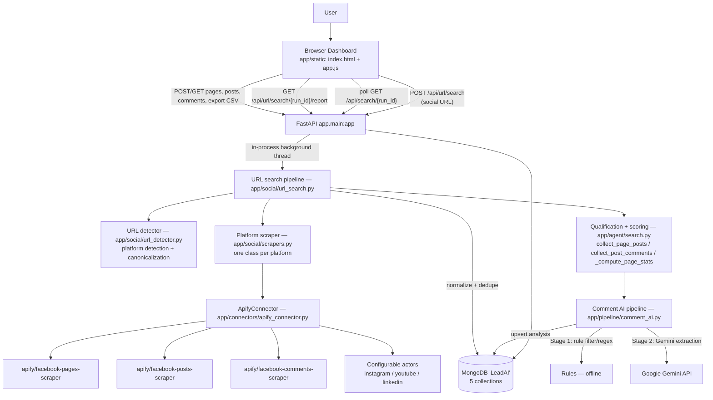
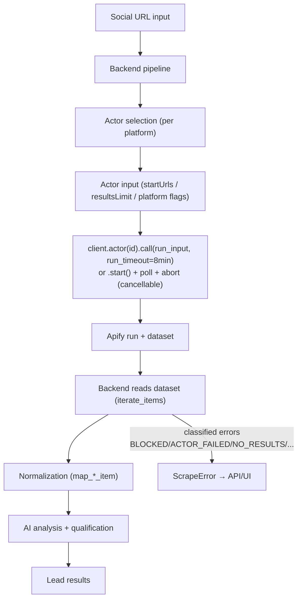
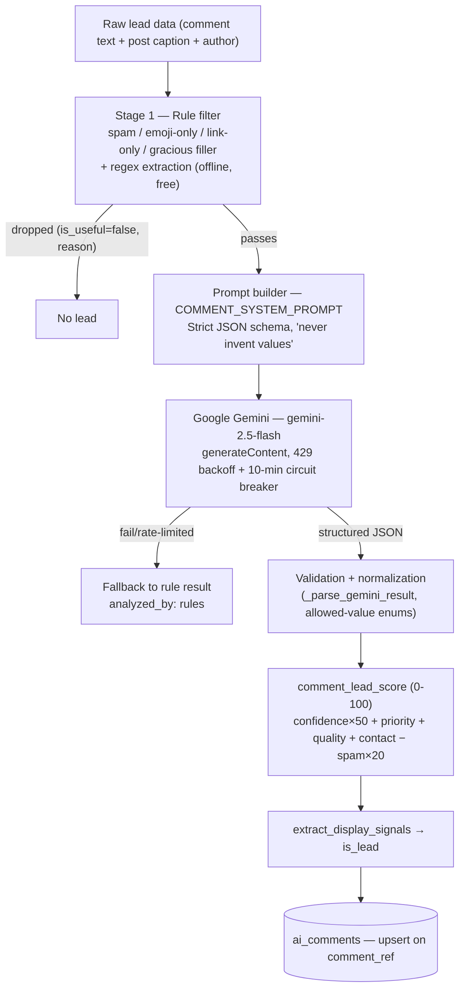

# LeadAI — AI-Orchestrated Social Lead Intelligence Platform

An AI-powered lead generation platform that works from a **single social URL**: paste a Facebook page, Instagram profile, YouTube channel or LinkedIn company link, and the platform finds the page's real data through **Apify** actors, drills down into posts and comments, and uses a **rule-based + Google Gemini** pipeline to extract, qualify and score high-intent leads — served through a FastAPI REST API with a browser dashboard.

Paste **`https://www.facebook.com/somepage`** (or an Instagram / YouTube / LinkedIn profile) and the platform:

1. Detects + canonicalizes the URL (`app/social/url_detector.py`),
2. Fetches the page details via the platform's Apify actor,
3. Collects the latest posts and auto-analyzes each post for relevance,
4. Collects comments (Facebook & Instagram only) from posts that qualify,
5. AI-analyzes each comment for phone, email, WhatsApp, budget, requirement, urgency and intent (buying / selling / rent / investment / other),
6. Scores leads 0–100 with a deterministic rank, and lets you export pages, posts and leads as CSV.

> **Stack:** FastAPI · MongoDB (Motor + PyMongo) · Apify actors · Google Gemini (optional — rule-based fallback) · Vanilla JS UI · Docker

---

## Table of Contents

- [1. Project Overview](#1-project-overview)
- [2. Key Features](#2-key-features)
- [3. Technology Stack](#3-technology-stack)
- [4. System Architecture](#4-system-architecture)
- [5. Folder Structure](#5-folder-structure)
- [6. End-to-End Workflow](#6-end-to-end-workflow)
- [7. URL-Based Lead Search Workflow](#7-url-based-lead-search-workflow)
- [8. Lead Data Model](#8-lead-data-model)
- [9. API Architecture](#9-api-architecture)
- [10. Apify Architecture](#10-apify-architecture)
- [11. AI Architecture](#11-ai-architecture)
- [12. Data Flow](#12-data-flow)
- [13. Error Handling](#13-error-handling)
- [14. Environment Variables](#14-environment-variables)
- [15. Installation](#15-installation)
- [16. Running the Project](#16-running-the-project)
- [17. Example Lead Search](#17-example-lead-search)
- [18. Cost and Resource Usage](#18-cost-and-resource-usage)
- [19. Security](#19-security)
- [20. Performance](#20-performance)
- [21. Logging and Monitoring](#21-logging-and-monitoring)
- [22. Testing](#22-testing)
- [23. Troubleshooting](#23-troubleshooting)
- [24. Security & Privacy Considerations](#24-security--privacy-considerations)
- [25. Current Implementation Status](#25-current-implementation-status)
- [26. Future Improvements](#26-future-improvements)
- [27. Developer Guide](#27-developer-guide)
- [28. Git Workflow](#28-git-workflow)
- [29. Architecture Summary](#29-architecture-summary)

---

## 1. Project Overview

### The problem

Businesses that sell high-value products (real estate, automobiles, interior design, wedding services, etc.) need a constant stream of qualified buyers. Facebook is full of buying signals — business pages post offers and interested people comment with phone numbers, budgets and urgent requirements. Manually reading thousands of comments is impossible.

### What LeadAI does

LeadAI automates the whole funnel from **a single social URL**:

- **Understands the target** — any Facebook page, Instagram profile, YouTube channel or LinkedIn company URL is detected, validated and canonicalized (`app/social/url_detector.py`). Groups, single posts/videos and malformed links are rejected with a clear error type.
- **Finds real data** — the URL is handed to the platform's Apify actor (`app/social/scrapers.py`). The agent never scrapes social media itself and never fabricates data — every stored value comes from real actor output.
- **Scores the page** — posts are collected and qualified: a post is *relevant* when its text mentions the target page's context, and *qualifying* when it also has at least `MIN_COMMENTS` (default 10) Facebook-reported comments. Pages get a deterministic `lead_score` from qualifying-post volume, comment volume and posting recency/activity.
- **Finds leads in comments** — comments on qualifying posts are collected and passed through a two-stage pipeline: a free, offline rule stage (filters filler/spam, regex-extracts phone/email/whatsapp/budget/location/urgency) and an optional Gemini stage (rich extraction of contact info, person context and buyer signals). Every lead gets a 0–100 `lead_score`, a priority (high/medium/low), a lead quality (hot/warm/cold) and a value list of `is_lead` display signals.
- **Presents and exports** — a live dashboard lets you drill page → posts → comments → lead cards, a standalone report page opens automatically per run, and any level can be exported as CSV.

### What makes it different from a simple scraper

- Deterministic, explainable **qualification logic** (relevance tokens + comment-count threshold) instead of dumping everything.
- **One provider, well integrated** — all scraping flows through `ApifyConnector` with classified errors and cancellation support.
- **AI analysis with a rule-based fallback** — the product works end-to-end even without a Gemini key.
- **Classified errors** — failures are labeled (`BLOCKED`, `ACTOR_FAILED`, `NO_RESULTS`, `ACCESS_DENIED`, ...) with run/dataset ids, so "no results" is never mistaken for a block.
- **Cancellable background jobs** with live status persisted in MongoDB.

### Who it is for

Sales teams, agencies and lead-generation businesses that already know which pages/profiles matter and want qualified buyers/sellers from social-media conversations — especially around Indian markets.

---

## 2. Key Features

Status legend: ✅ Implemented · 🟡 Partially Implemented · ⬜ Planned

| Feature | Status | Where |
| --- | --- | --- |
| URL-based search: Facebook / Instagram / YouTube / LinkedIn | ✅ | `POST /api/url/search` → `app/social/` |
| URL detection + canonicalization (groups/posts/videos rejected) | ✅ | `app/social/url_detector.py` |
| Per-platform Apify actors (configurable actor ids) | ✅ | `app/social/scrapers.py` + `app/config.py` |
| Graceful fallback page doc when details actor fails | ✅ | `_url_derived_page` in `app/social/url_search.py` |
| Facebook page detail extraction (followers, likes, category, about, phone, email, website, address, photos, verified) | ✅ | `apify/facebook-pages-scraper` + `map_page_item` |
| Facebook post collection (caption, images, videos, links, likes, comments, shares, date) | ✅ | `apify/facebook-posts-scraper` |
| Facebook comment collection (text, author, profile URL, date, reactions) | ✅ | `apify/facebook-comments-scraper` |
| Comments for Instagram too; YouTube/LinkedIn skip comments | ✅ | `app/social/scrapers.py` (`comments_supported`) |
| Contact-info flagging (10-digit phone / email in comment) | ✅ | `has_contact_info` in `app/pipeline/comment_ai.py` |
| Rule-based comment screening (spam / filler / emoji / link-only) | ✅ | Stage 1 of `comment_ai.py` |
| Gemini comment analysis (contacts, budget, requirement, intent, urgency, quality) | ✅ (needs `GEMINI_API_KEY`) | Stage 2 of `comment_ai.py` |
| Buyer/seller/other intent classification | ✅ | Gemini `lead_type` + rule path (`buying` intent) |
| Lead quality (hot/warm/cold) and priority (high/medium/low) | ✅ | Gemini + `comment_lead_score` |
| Deterministic 0–100 lead score | ✅ | `comment_lead_score` in `comment_ai.py` |
| Page lead ranking (qualifying posts, comments, activity) | ✅ | `_lead_score` in `app/agent/search.py` |
| Post qualification (relevant + ≥ MIN_COMMENTS) | ✅ | `_is_qualifying_post` |
| Duplicate removal (unique URLs per run, unique comment analysis) | ✅ | Mongo unique indexes |
| CSV export (pages / posts / leads) | ✅ | `GET /api/export/*.csv` |
| MongoDB persistence (5 collections) | ✅ | `app/db/` |
| Search history (URL runs stored with live status) | ✅ | `GET /api/search/history` |
| Run cancellation (aborts in-flight Apify run) | ✅ | `POST /api/search/{run_id}/cancel` |
| Standalone URL-search report page | ✅ | `/static/url_report.html` |
| Live progress polling (UI progress bar + status fields) | ✅ | `app.js` `pollSearchRun` |
| Post comment-scrape skipping under the threshold | ✅ | `collect_post_comments` status `skipped` |
| Lead detail view (comment + post + page context) | ✅ | `GET /api/comments/{id}` + modal |
| Page filters (category / city / name / has-contact) | ✅ | `GET /api/pages` |
| Comments filter (contact-only / leads-only) | ✅ | `GET /api/posts/{id}/comments` |
| Authentication — admin email/password login (hashed, constant-time compare, brute-force throttle) | ✅ | `app/auth/` + `POST /api/auth/login` + `/login` |
| User management / multi-tenancy | ⬜ | Not implemented — single admin account, open API after login |
| Rate limiting (API level) | ⬜ | Not implemented (provider-side 429s are handled) |
| Webhooks / background job queue / analytics | ⬜ | Not implemented — background tasks are in-process |
| Export to Excel/Sheets/CRM | ⬜ | CSV only |
| More social platforms (Twitter/X, Pinterest, etc.) | ⬜ | Only FB/IG/YT/LinkedIn URL search exists |

---

## 3. Technology Stack

| Layer | Technology | Purpose |
| --- | --- | --- |
| Frontend | Vanilla HTML5 / CSS3 / JavaScript (no framework, no build step) | Dashboard: URL search, pages, posts, comments, lead cards, CSV export |
| Backend | FastAPI + Uvicorn (Python) | REST API, static hosting, background task orchestration |
| Programming Language | Python 3.11+ (Docker image `python:3.11-slim`) | Entire backend |
| AI Model | Google Gemini `gemini-2.5-flash` (configurable) | Comment analysis |
| AI Access | REST `generativelanguage.googleapis.com/v1beta` via `httpx` | No SDK dependency |
| Scraping | Apify (official `apify-client`) — 3 Facebook actors + configurable IG/YT/LinkedIn actors | All social data collection |
| Database | MongoDB (`mongo:7` in Docker) — Motor (async) for API handlers, PyMongo (sync) for background threads | Persistence of pages/posts/comments/analysis/history |
| API | REST (FastAPI), docs at `/docs` (Swagger UI) | All product surface |
| Authentication | None (not implemented) | — |
| Configuration | `pydantic-settings` reading `.env` | All settings |
| Deployment | Docker + docker-compose (API + Mongo) | Containerized run |
| Code quality | Ruff (lint) + mypy (type checks) | Dev workflow (caches in repo) |
| Testing | `pytest`-style acceptance tests + standalone integration check | `tests/` |

Key libraries (`requirements.txt`): `fastapi`, `uvicorn[standard]`, `pydantic`, `pydantic-settings`, `motor`, `pymongo`, `httpx`, `apify-client`.

---

## 4. System Architecture



### Components

- **`app/main.py`** — FastAPI application (v2.1.0). Sets up console (INFO) + file (DEBUG) logging, starts the Mongo index check at startup, mounts the static frontend, and exposes `/health`, `/`, `/dashboard`.
- **`app/api/routes/search.py`** — the entire REST surface. All long-running operations (`collect_page_posts`, `collect_post_comments`, URL search) run as **in-process background tasks** (`asyncio.create_task` + `asyncio.to_thread` / a daemon thread); GET endpoints expose live status fields for polling. A `_tasks` registry prevents duplicate jobs for the same page/post/run.
- **`app/social/url_search.py`** — the URL-search orchestrator ("the only brain between the user and social media"). Runs in a daemon thread, writes live status to `search_history`, and drives page → posts → comments → AI analysis.
- **`app/social/url_detector.py`** — platform detection + canonicalization for FB/IG/YT/LinkedIn, with classified `UrlError` (invalid / unsupported).
- **`app/social/scrapers.py`** — one `SocialMediaScraper` subclass per platform over `ApifyConnector`; normalizes platform-specific actor items into the shared document shapes (`map_*_item` from `app/agent/search.py`).
- **`app/agent/search.py`** — the shared lead-collection engine (used by both the dashboard drill-down and URL search): `collect_page_posts`, `collect_post_comments`, normalizers (`map_page_item`, `map_post_item`, `map_comment_item`), relevance/qualification logic, page scoring (`_compute_page_stats`, `_lead_score`, `_activity_status`), and cancellation helpers.
- **`app/connectors/apify_connector.py`** — thin wrapper over `apify-client` with classified error objects (`ScrapeError`), run timeouts, cancellation polling (`actor.start()` + `run.get()/abort()`), and request/response logging.
- **`app/pipeline/comment_ai.py`** — the lead-analysis brain: Stage 1 rule filtering + regex extraction, Stage 2 Gemini structured JSON extraction, `comment_lead_score` (0–100), `extract_display_signals` / `is_lead`, and persistence into `ai_comments`.
- **`app/db/`** — `mongo.py` (Motor + PyMongo clients, DNS override, index creation) and `models.py` (Pydantic models for all five collections).
- **`app/static/`** — `index.html` (dashboard), `app.js` (workflow state in `localStorage`, polling, rendering, exports), `styles.css`, `url_report.html` (standalone URL-search report page).

---

## 5. Folder Structure

```text
lead_apify/
├── app/
│   ├── main.py                  # FastAPI app, CORS, static mount, logging, /health
│   ├── config.py                # pydantic-settings: all .env-driven settings
│   ├── agent/
│   │   └── search.py            # lead engine: collect_page_posts, collect_post_comments,
│   │                            #   mappers, qualification + scoring, cancel helpers
│   ├── api/
│   │   └── routes/search.py     # all REST endpoints + background task management
│   ├── connectors/
│   │   └── apify_connector.py   # 3 Facebook actors + generic actor + classified ScrapeError
│   ├── db/
│   │   ├── mongo.py             # async/sync clients, DNS override, ensure_indexes()
│   │   └── models.py            # Pydantic models: pages, posts, comments, ai_comments, history
│   ├── pipeline/
│   │   └── comment_ai.py        # rule filter → Gemini extraction → score → ai_comments
│   ├── social/
│   │   ├── url_detector.py      # detect+canonicalize FB/IG/YT/LinkedIn URLs
│   │   ├── url_search.py        # URL-search background pipeline (page→posts→comments)
│   │   └── scrapers.py          # platform scraper classes over ApifyConnector
│   └── static/
│       ├── index.html           # dashboard: URL search / pages / posts / comments views
│       ├── app.js               # polling, workflow memory, rendering, CSV exports
│       ├── styles.css           # all styling
│       └── url_report.html      # standalone report for URL-search runs
├── tests/
│   ├── test_qualification.py    # lead-qualification acceptance tests
│   ├── test_url_search.py       # URL detection/canonicalization + error classification tests
│   └── integration_check.py     # end-to-end pipeline check against a scratch Mongo DB
├── scratch/                     # dev-only diagnostic scripts (gitignored)
├── logs/                        # app.log (file logging, gitignored)
├── .env.example                 # template for environment variables
├── .gitignore
├── docker-compose.yml           # api + mongo:7
├── Dockerfile                   # python:3.11-slim image
├── requirements.txt
└── README.md
```

### Important files in detail

| File | Role in the workflow |
| --- | --- |
| `app/social/url_search.py` | The URL-search orchestrator. Detects the platform, fetches page details (with graceful fallback), collects posts, collects + AI-analyzes comments (FB/IG), computes page stats and finalizes the run — all with live `search_history` updates and cancellation checkpoints. |
| `app/social/scrapers.py` | Per-platform Apify actor wrappers with best-effort field mapping into the shared document shapes. Facebook reuses the exact keyword-flow mappers; IG/YT/LinkedIn map into the same shapes with a `platform` field. |
| `app/agent/search.py` | The shared lead engine — drill-down collection (`collect_page_posts`, `collect_post_comments`), all normalizers (`map_*_item`) and scoring (`_compute_page_stats`, `_lead_score`). Imported by both the URL-search pipeline and the dashboard. |
| `app/pipeline/comment_ai.py` | The only AI job. `analyze_comment_ai()` (rules → Gemini), `comment_lead_score()`, `extract_display_signals()`/`should_display_comment()`, `analyze_comments_for_post()` (batch, upserts `ai_comments`). |
| `app/connectors/apify_connector.py` | All Apify calls (`scrape_facebook_pages_by_urls`, `scrape_facebook_posts`, `scrape_facebook_comments`, generic `scrape_actor`) with error classification. |
| `app/api/routes/search.py` | REST layer; the `_start`/`_background` helpers serialize jobs per key so a page's posts can't be collected twice. |
| `app/static/app.js` | Frontend workflow: URL search → poll run → pages → posts → comments → lead modal; workflow memory persisted in `localStorage` (`leadai_run_id`, `leadai_page_id`, `leadai_post_id`). |

---

## 6. End-to-End Workflow

### Step 1 — User enters a social URL

The dashboard's single search form accepts a **Facebook page, Instagram profile, YouTube channel or LinkedIn company** URL plus a max-posts count (default 20).

### Step 2 — Request reaches the backend

`POST /api/url/search?url=&max_posts=` — `url` 4–300 chars; detected and canonicalized by `detect_social_url()`; invalid/unsupported URLs return 422 with an `errorType` (`invalid` | `unsupported`). The endpoint immediately persists a `search_history` document (`status: running`, `phase: queued`), generates a `run_id` (prefixed `URL`), registers the background pipeline, and returns immediately. No request ever blocks the API.

### Step 3 — URL validation and platform detection

`detect_social_url()` (`app/social/url_detector.py`) maps the host to a platform, verifies the URL shape against per-platform rules, and canonicalizes it (tracking params and trailing slashes dropped, path never rewritten, missing scheme auto-prefixed). Unsupported domains raise `UrlError(kind="unsupported")`; malformed profile URLs raise `kind="invalid"`.

### Step 4 — Page details

The platform scraper fetches the profile via its Apify actor (`apify/facebook-pages-scraper`, `apify/instagram-scraper`, `streamers/youtube-scraper`, `harvestapi/linkedin-company` — all overridable in `.env`), normalized into the `facebook_pages` shape with a `platform` field. **Graceful fallback**: when the details actor fails (access/credits/blocked/private), a minimal URL-derived page doc is still created (`_url_derived_page`) so posts/comments remain usable.

### Step 5 — Posts

Fetched (default 20, capped 1–100) and stored with per-page dedupe; live counts update on the page doc. Every post is flagged `is_relevant` (caption mentions the target context) and `is_qualifying` (relevant **and** Facebook-reported total comments ≥ `MIN_COMMENTS`).

### Step 6 — Comments (Facebook & Instagram only)

Only posts with `total_comment_count >= MIN_COMMENTS` are scraped — low-engagement posts are skipped (`comments_status: "skipped"`), saving Apify cost. Collected comments are deduped, flagged `has_contact` (10-digit phone or email), and each post's comments run through `analyze_comments_for_post` for the full AI treatment.

### Step 7 — Page scoring

`_compute_page_stats` aggregates the stored posts: qualifying counts, total comments on qualifying posts, latest post date → `activity_status` (active ≤ 90 days / recent ≤ 365 / inactive / unknown) and a deterministic `lead_score`.

### Step 8 — Finalize

A run that got neither details nor posts is marked `error` with the real reason; otherwise `completed`. Results are browsable through the normal dashboard (`GET /api/pages?run_id=`) and the dedicated report page (`GET /api/url/search/{run_id}/report` → `/static/url_report.html`), which opens automatically when the run finishes.

---

## 7. URL-Based Lead Search Workflow

Dedicated to `POST /api/url/search` → `app/social/`:

```text
User enters URL
        ↓
URL validation + canonicalization (url_detector.py)
        ↓
Platform detection (facebook | instagram | youtube | linkedin)
        ↓
Page/profile/channel/company identification
        ↓
Scraping via the platform's Apify actor (scrapers.py)
        ↓
Posts
        ↓
Comments (Facebook & Instagram only)
        ↓
Lead extraction (rule + Gemini pipeline)
        ↓
Qualified leads → report page / CSV / dashboard
```

**Supported platforms and rules** (`app/social/url_detector.py`):

| Platform | Accepted shapes | Rejected |
| --- | --- | --- |
| Facebook | `facebook.com/<handle>`, `/pages/<name>/<numeric-id>`, `profile.php?id=<numeric>`, `m./web./fb.com` aliases | groups, marketplace, events, photo/watch/stories links, login/help pages |
| Instagram | `instagram.com/<username>` (1–30 chars, `[A-Za-z0-9._]`) | post links (`/p/...`), sub-paths (`/photos/`) |
| YouTube | `youtube.com/@<handle>`, `/channel/...`, `/user/...`, `/c/...` | single videos (incl. `youtu.be`) |
| LinkedIn | `linkedin.com/company/<slug>`, `/school/...`, `/showcase/...` | profiles, posts, feed links |

Canonicalization **only drops tracking params and trailing slashes** — the identifying path is never rewritten. Missing scheme (`instagram.com/x`) is auto-prefixed with `https://`.

**Comment support per platform**: Facebook ✅ (top comments, `RANKED_UNFILTERED` with nested comments), Instagram ✅, YouTube ❌ (video comments not collected), LinkedIn ❌. `MAX_COMMENTS_TO_COLLECT` (default 100) caps the whole run; at most 30 comments per post.

---

## 8. Lead Data Model

Five MongoDB collections, all documents stored from **real actor output only** (absent values are `None`/omitted, never fabricated). Pydantic models live in `app/db/models.py`.

### `facebook_pages` — one doc per real page

| Field | Type | Description | Source |
| --- | --- | --- | --- |
| `page_id` | str | Facebook/network page id | actor `pageId` or extracted from URL |
| `page_name` | str | Page name (title cleaned, `"Name \| City"` split) | `pageName`/`title`/`name` |
| `facebook_url` | str | Page URL (unique per run) | actor `facebookUrl` etc. |
| `platform` | str | `facebook` \| `instagram` \| `youtube` \| `linkedin` | URL search |
| `category` | str | Page category | `category`/`categories`/`industry` |
| `about` | str | Intro/about text | `intro`/`about`/`info`/`biography` |
| `followers`, `likes` | int | Follower/like counts | actor counts (K/M/B parsed) |
| `verified` | bool | Verified badge | actor flag |
| `phone`, `email`, `whatsapp`, `website` | str | Contacts | actor contact fields (junk URLs filtered) |
| `address`, `city`, `state`, `country` | str | Location | `location` / `address` |
| `profile_picture`, `cover_image` | str | Photo URLs | actor photo fields |
| `source_type` | str | `page_url` \| `profile_url` \| `channel_url` \| `company_url` | URL pattern |
| `source`, `source_page_url`, `search_run_id`, `search_keyword`, `provider` | str | Provenance | agent run |
| `details_error`, `details_error_type` | str/None | Why the details actor failed (fallback page doc) | URL search |
| `posts_status`, `posts_count`, `posts_error`, `posts_collected_at` | str/int/None | Post-collection progress | live updates |
| `total_posts_found`, `relevant_posts_count`, `qualifying_posts_count`, `total_comments_on_qualifying_posts`, `latest_post_date`, `has_qualifying_posts`, `activity_status`, `lead_score` | mixed | Post analytics (computed) | `_compute_page_stats` |
| `created_at`, `updated_at` | datetime | Timestamps | agent |

### `facebook_posts` — one doc per post of the page

| Field | Type | Description | Source |
| --- | --- | --- | --- |
| `post_id`, `post_url` | str | Post identity (URL unique per page) | actor |
| `page_id`, `page_name`, `page_ref` | str | Parent page (ObjectId link) | agent |
| `platform` | str | Platform of the parent page | URL search |
| `caption` | str | Full post text (never truncated) | `text`/`caption`/`postText`/`title` |
| `images`, `videos`, `external_links` | list[str] | Media and links | actor fields |
| `published_date` | str | Post date | actor |
| `likes_count`, `shares_count` | int | Engagement | actor |
| `total_comment_count` | int | **Platform-reported total — never overwritten** | actor |
| `scraped_comment_count` | int | Comments actually collected into the DB | collection progress |
| `comments_count` | int | Legacy alias of `total_comment_count` | mapping |
| `is_relevant`, `is_qualifying` | bool | Qualification flags (computed) | `_post_relevant` / threshold |
| `comments_status`, `comments_error`, `comments_collected_at` | str/int/None | Comment-collection progress | live updates |
| `search_run_id`, `provider` | str | Provenance | agent |

### `facebook_comments` — one doc per comment of the post

| Field | Type | Description | Source |
| --- | --- | --- | --- |
| `comment_id`, `comment_url` | str | Comment identity (URL unique per post) | actor (URL synthesized from `?comment_id=` if missing) |
| `author_name`, `author_profile_url` | str | Commenter | actor / nested `author` |
| `text` | str | Comment text | `text`/`comment`/`body` |
| `published_date`, `reactions_count` | str/int | Metadata | actor |
| `has_contact` | bool | Phone or email present in text | `has_contact_info` |
| `post_id`, `post_url`, `page_id`, `post_ref`, `search_run_id`, `platform` | str | Parent context | agent |

### `ai_comments` — AI analysis of one comment (unique on `comment_ref`)

| Field | Type | Description | Source |
| --- | --- | --- | --- |
| `comment_ref`, `comment_id`, `comment_text`, `commenter_name` | str | Comment identity | raw comment doc |
| `post_ref`, `post_id`, `post_url`, `page_ref`, `page_name` | str | Parent context | agent |
| `phone`, `email`, `whatsapp`, `website` | str | Extracted contacts | rules/Gemini (`None` when unknown) |
| `budget`, `requirement`, `location` | str | Buyer signals | rules/Gemini |
| `intent` | str | `buying` \| `selling` \| `rent` \| `investment` \| `other` | Gemini buyer intent |
| `urgency` | str | Timeline signal | rules/Gemini |
| `priority` | str | `high` \| `medium` \| `low` | Gemini/rules |
| `lead_quality` | str | `hot` \| `warm` \| `cold` | Gemini (`none` on rule path) |
| `confidence` | float | 0–1 confidence | Gemini |
| `lead_score` | int | 0–100 deterministic rank | `comment_lead_score` |
| `is_lead` | bool | Displayed as a lead candidate | `extract_display_signals` |
| `reason` | str | Why the comment was kept/dropped | rules/Gemini |
| `details` | dict | Full nested extraction (contact/person/buyer) | rules/Gemini |
| `analyzed_by` | str | `rules` \| `gemini` | pipeline |
| `analyzed_at` | datetime | When analyzed | pipeline |

### `search_history` — one doc per agent run

| Field | Type | Description |
| --- | --- | --- |
| `run_id` | str | Unique run id (URL runs prefixed `URL`) |
| `query`, `intent` | str/dict | Raw URL + parsed `{keyword, type: url, platform, canonical_url, limit}` |
| `limit`, `provider`, `url_search` | int/str/bool | Run options |
| `status` | str | `running` \| `completed` \| `partial` \| `error` \| `cancelled` |
| `phase`, `message` | str | Live progress (queued/page/posts/comments/completed) |
| `error`, `error_meta` | str/dict | Structured failure (ScrapeError payload) |
| `pages_found`, `pages_stored` | int | Counts |
| `scrape_info` | dict | Last Apify call metadata (`actorId`, `runId`, `datasetId`, `status`, `itemsReturned`) |
| `created_at`, `completed_at`, `updated_at` | datetime | Timestamps |

---

## 9. API Architecture

Interactive docs: [http://localhost:8000/docs](http://localhost:8000/docs) (Swagger UI). All routes are under `/api` except `/health`, `/`, `/dashboard` and the static mount.

| Method | Endpoint | Purpose | Request | Response |
| --- | --- | --- | --- | --- |
| GET | `/health` | App + provider config status | — | `{status, apify_configured}` |
| POST | `/api/url/search` | Start URL-based search | `url` (4–300), `max_posts` (1–100) | `{run_id, status, platform, canonical_url}` |
| GET | `/api/url/search/{run_id}/report` | Full report bundle (page+posts+comments+AI) | — | `{page, posts, comments, status, message, platform, search_url}` |
| GET | `/api/search/history` | Recent runs | `limit` (1–100) | `{searches, count}` |
| GET | `/api/search/{run_id}` | Run status + pages of the run | — | `{success, items, count, scrape_info, search, pages}` |
| POST | `/api/search/{run_id}/cancel` | Cancel a running search (aborts Apify run) | — | `{run_id, status}` |
| GET | `/api/pages` | List/filter pages | `run_id`, `q` (name), `category`, `city`, `contact` (bool), `offset`, `limit` | `{pages, total, offset, limit}` |
| GET | `/api/pages/{id}` | One page | — | page doc |
| POST | `/api/pages/{id}/posts` | Collect posts of the page (background) | `max_posts` (1–100) | `{status: running}` |
| GET | `/api/pages/{id}/posts` | Cached posts + collection status + page stats | `offset`, `limit` | `{page, posts, total, qualifyingPosts, activityStatus, leadScore, ...}` |
| GET | `/api/posts/{id}` | One post | — | post doc |
| POST | `/api/posts/{id}/comments` | Collect comments + AI analysis (background) | `max_comments` (1–500, default 200) | `{status: running}` (or `skipped` under threshold) |
| GET | `/api/posts/{id}/comments` | Analyzed comments | `only_leads`, `contact_only` (default true), `offset`, `limit` | `{post, comments, total, contact_count, comments_status, ...}` |
| GET | `/api/comments/{id}` | Lead detail (analysis + comment + post + page) | — | merged doc |
| GET | `/api/export/pages.csv` | CSV of pages | `run_id` (optional) | CSV file |
| GET | `/api/export/posts.csv` | CSV of posts | `page_id` (required) | CSV file |
| GET | `/api/export/comments.csv` | CSV of analyzed comments/leads | `post_id` (required), `only_leads` (default true) | CSV file |

**Important endpoints in detail:**

- **`POST /api/url/search`** — validates + canonicalizes the URL, creates the `search_history` doc, registers the background `UrlSearchThread` and returns immediately. All later state changes happen on the `search_history` doc — the UI polls `GET /api/search/{run_id}`.
- **`POST /api/search/{run_id}/cancel`** — sets `cancel_requested: true`; background workers check it at checkpoints and, when mid-Apify, call `run_client.abort()` (polling mode) so the actor actually stops. Final status becomes `cancelled`.
- **`GET /api/url/search/{run_id}/report`** — bundles the run's page + up to 30 posts + up to 100 comments (enriched with AI fields) for the standalone report page.
- **`GET /api/pages`** — stable sort by `lead_score` desc, then `followers`; supports name regex (`q`), exact `category`/`city` and a `contact` filter (`$or` on email/phone not-null). Returns `total` for pagination.
- **`GET /api/pages/{id}/posts`** — returns cached posts; adds legacy aliases (`total_comment_count` fallback to `comments_count`, `postId`, `postUrl`, `postText`, `commentCount`, `reactionsCount`, `sharesCount`, `createdTime`, `thumbnail`) for frontend compatibility; includes the full page stat bundle and `minComments`.
- **`GET /api/posts/{id}/comments`** — two modes: `only_leads=true` queries `ai_comments` (`is_lead: true`, sorted by `lead_score` desc) enriched with raw comment fields; otherwise all raw comments are enriched with quick regex contacts and any stored AI analysis, filtered by `contact_only` (default true), newest first with contact comments pinned on top.
- **`GET /api/export/{scope}.csv`** — server-side CSV generation (`csv` stdlib) with fixed column sets; comments export uses `ai_comments` rows (phone/email/whatsapp/website/budget/requirement/location/intent/urgency/priority/lead_quality/confidence/lead_score) so it is effectively a **leads export**.

---

## 10. Apify Architecture



### Facebook actors (hardcoded)

| Actor | Purpose | Input | Output (used fields) | Triggered by |
| --- | --- | --- | --- | --- |
| `apify/facebook-pages-scraper` | Page details by URL | `{startUrls: [{url}]}` | verified, email, phone, whatsapp, website, about, photos, followers, category | Page details in URL search (Facebook) |
| `apify/facebook-posts-scraper` | Posts of a page | `{startUrls, resultsLimit, captionText: true}` | post url/id/text/media/dates/likes/comment count/shares | `POST /api/pages/{id}/posts`; URL search (Facebook) |
| `apify/facebook-comments-scraper` | Comments of a post | `{startUrls, resultsLimit, includeNestedComments: true, viewOption: RANKED_UNFILTERED}` | comment id/url/text/author/date/reactions | `POST /api/posts/{id}/comments`; URL search (Facebook) |

### Configurable URL-search actors (defaults in `app/config.py`, override in `.env`)

| Platform | Default actor id | Input highlights | Comments |
| --- | --- | --- | --- |
| Instagram | `apify/instagram-scraper` | `directUrls`, `resultsType: details/posts/comments`, `resultsLimit` | Comments supported ✅ |
| YouTube | `streamers/youtube-scraper` | `startUrls`, `maxResults`, `onlyChannelVideos`, `extractChannelInfo` | Comments not collected |
| LinkedIn | `harvestapi/linkedin-company` + `harvestapi/linkedin-company-posts` | `companies` / `targetUrls`, `maxPosts`, `scrapeComments`, `maxComments` | Comments supported ✅ |

### Run lifecycle and error handling

- Every call is wrapped with `run_timeout`/`wait_duration` of **8 minutes** (`_RUN_TIMEOUT_MIN`) so a blocked actor can never hang the pipeline for hours.
- **Cancellable runs** use `actor.start()` then poll `client.run(id).get()` every 5 s; a cancellation request calls `run.abort()` server-side.
- Datasets are read lazily via `iterate_items()`; retrieval failures are classified (`DATASET_ERROR`).
- Errors are **classified, never guessed** (`ScrapeError` with `errorType`): `BLOCKED` (only when run `statusMessage`/stats contain block/captcha/rate-limit evidence), `ACTOR_FAILED`, `ACTOR_TIMED_OUT`, `INVALID_INPUT` (400), `API_ERROR` (401/403/429/5xx — account/credits problems, explicitly never blamed on Facebook), `ACCESS_DENIED` (403 with actor-access wording → "needs paid subscription"), `NETWORK_ERROR`, `NO_RESULTS` (successful empty run). Billing hints ("insufficient credits", "upgrade to a paid plan") produce a user-facing `ApifyError` with a billing link.
- Request/response diagnostics: `[Apify][REQ]` at DEBUG with the full input, `[Apify][RESP]` at INFO with actor/runId/datasetId/status.
- **Cost control**: `MIN_COMMENTS` gates the expensive comments actor, and posts below threshold are never comment-scraped (`skipped`).

---

## 11. AI Architecture



- **Provider**: Google Gemini via direct REST (`https://generativelanguage.googleapis.com/v1beta/models/{model}:generateContent?key=...`), no SDK. Model default `gemini-2.5-flash` (`GEMINI_MODEL`).
- **The only AI call site**: `app/pipeline/comment_ai.py::analyze_comment_ai` — comment analysis (temperature 0.1), invoked per post by `analyze_comments_for_post` from both the URL-search pipeline and the dashboard drill-down.
- **Input to the model**: JSON payload with `author`, `post_caption`, `comment_text` — one comment per call.
- **Output format**: strict JSON with `is_useful`, `lead_type`, `confidence_score`, `priority`, `lead_quality`, `sentiment`, `spam_score`, `duplicate_score`, `contact{}`, `person{}`, `buyer{}`; parsed defensively (`_parse_gemini_result`) — enums are matched loosely (`_pick`), numbers clamped to 0–1, strings cleaned and null-normalized.
- **Lead classification**: `lead_type` (buyer/seller/broker/other/none), buyer `intent` (buying/selling/rent/investment/other), `priority`, `lead_quality` (hot/warm/cold), plus the deterministic `comment_lead_score` (0–100) and `is_lead` signal detection.
- **Error handling & fallback**: a `429` opens a 10-minute circuit breaker (`_GEMINI_DISABLED_UNTIL`) so a whole batch isn't slowed; any exception or missing key falls back to the Stage-1 rule result (`analyzed_by: "rules"`). Without `GEMINI_API_KEY` **everything still works** on rules — only richer fields are missing.
- **Rule path**: `rule_based_classify` + `_rule_extraction` (regex contact/budget/location/urgency/intent extraction, `buying` intent when requirement/urgency/budget/city present, `high` priority + `buyer` lead_type when a phone/email/URL is present).

---

## 12. Data Flow

```mermaid
flowchart LR
    USER[USER] --> FE[FRONTEND app.js]
    FE -->|POST + poll| API[BACKEND API routes]
    API -->|background task| AG[URL SEARCH PIPELINE url_search.py]
    AG --> PROV[PROVIDER — Apify actors]
    PROV --> RAW[RAW ACTOR DATA]
    RAW --> NORM[NORMALIZERS map_*_item]
    NORM --> DB[(MONGODB — 5 collections)]
    NORM --> AI[AI ANALYSIS comment_ai]
    AI --> QUAL[LEAD QUALIFICATION<br/>score / priority / is_lead]
    QUAL --> DB
    DB --> RESP[API RESPONSE — serialized docs]
    RESP --> FE
    FE --> USER
```



1. **User → Frontend**: a social URL typed into the dashboard form.
2. **Frontend → Backend API**: POST starts the run; GET endpoints poll live status (`search_history`), then fetch pages/posts/comments/leads.
3. **Backend → Pipeline**: the route spawns the `UrlSearchThread` daemon (keys in `_tasks` prevent duplicate jobs); drill-down jobs use `asyncio.to_thread`.
4. **Pipeline → Provider**: the platform scraper runs its Apify actor with timeouts and cancellation support.
5. **Provider → Raw data**: dataset items (never modified by the connector).
6. **Raw → Normalizers**: `map_*_item` resolve field aliases, parse K/M/B counts, clean junk, compute relevance/qualification flags.
7. **Normalizers → MongoDB**: deduped inserts/upserts into the five collections with real-time status fields.
8. **Comments → AI**: `analyze_comments_for_post` runs Stage 1 rules → Stage 2 Gemini; results upserted to `ai_comments`.
9. **Qualification**: `comment_lead_score` + `is_lead` decide what is a lead; the UI filters by contact/leads.
10. **DB → API response**: Motor-driven async queries, `_serialize` converts ObjectId/datetime for JSON.
11. **API → Frontend**: tables, status bars, lead modal, report page, CSV downloads.

---

## 13. Error Handling

The project treats failures as **data**, not just exceptions. The connector layer classifies every scrape failure into a `ScrapeError` with a structured `.error` payload (`{success, errorType, message, keyword, actorId, runId, datasetId, itemsReturned, details}`), which is persisted to `search_history`/`posts_error_meta`/`comments_error_meta` and surfaced by the API and UI.

| Scenario | What happens |
| --- | --- |
| Invalid URL / unsupported platform | `detect_social_url` raises `UrlError`; route returns **422** `{success, errorType: invalid\|unsupported, message}`. |
| Invalid ObjectId | `_oid()` → **400** `Invalid id: ...`. |
| Missing document | `_doc_or_404` → **404** `<collection> document not found`. |
| Mongo unreachable | Handlers return **503** `Database unavailable`; startup index creation logs a warning and skips; background agents return `{status: error, error: "Database unavailable"}`. |
| Missing `APIFY_API_TOKEN` | Startup logs a warning with a signup link; URL searches fail fast with a clear message stored on the run. |
| Apify actor run failed | `ACTOR_FAILED` with `statusMessage`; run marked `error`; UI shows "Retry". |
| Apify run timed out (> 8 min) | `ACTOR_TIMED_OUT` — actor aborted server-side + local watchdog; "retry" message. |
| Apify API-level errors | 401 → invalid token; 403 → `ACCESS_DENIED` (actor needs paid plan/credits) or `API_ERROR`; 429 → rate-limited, wait and retry; 5xx → API server error. All explicitly **never** described as a Facebook block. |
| Facebook blocking evidence | Only when the run's `statusMessage`/`stats` contain block/captcha/rate-limit tokens → `BLOCKED` "Facebook may have blocked the request — wait a few minutes and retry." |
| Empty results | `NO_RESULTS` from a successful run — never treated as a block. |
| Billing/credit exhaustion | Billing hints in error text → user-facing `ApifyError` with `console.apify.com/billing` link. |
| Posts scrape returns nothing | Page `posts_status: empty` + message `"No posts returned for this page"`; UI shows it with a Retry button. |
| Comments below threshold | Post `comments_status: skipped` with `"Not scraped — post has N comments (needs ≥ 10)"` — no API call made. |
| Gemini failure / 429 | Circuit breaker (10 min), rule-based fallback, `analyzed_by: "rules"`; batch continues; error logged. |
| Page details actor fails during URL search | Graceful fallback: minimal URL-derived page doc keeps posts/comments usable; `details_error`/`details_error_type` recorded; a run with no posts AND no details is marked `error` with the real reason. |
| Cancellation mid-run | `CANCELLED` ScrapeError; Apify run aborted; statuses flip to `cancelled` with "Search cancelled by user". |
| Stale "running" status (crash/restart) | `_stale()` (30 min) lets the UI offer Retry instead of blocking forever. |
| Duplicate key on insert | Handled by design via per-run dedupe lookups and unique indexes; URL-search comment inserts catch `DuplicateKeyError` and skip. |
| Unsupported CSV scope | **404** `scope must be pages, posts or comments`. |

---

## 14. Environment Variables

All settings are defined in `app/config.py` (`pydantic-settings`, `.env` file, `extra="ignore"`). Template: `.env.example`. **Never commit real keys** — the repo ignores `.env` (`.gitignore`).

| Variable | Required | Default | Purpose |
| --- | --- | --- | --- |
| `GEMINI_API_KEY` | No¹ | — | Google Gemini key for comment analysis (without it, rule-based only) |
| `GEMINI_MODEL` | No | `gemini-2.5-flash` | Gemini model id |
| `MONGO_URI` | Yes | `mongodb://localhost:27017` | MongoDB connection string (supports `mongodb+srv://`) |
| `MONGO_DB_NAME` | Yes | `LeadAI` | Database name |
| `DNS_SERVERS` | No | `8.8.8.8,1.1.1.1` | Comma-separated resolvers for `mongodb+srv://` SRV lookups (empty = system DNS) |
| `APIFY_API_TOKEN` | Yes² | — | Apify API token (https://apify.com/account/integrations) |
| `MIN_COMMENTS` | No | `10` | Comment-count threshold for a post to qualify (`0` disables) |
| `INSTAGRAM_ACTOR_ID` | No | `apify/instagram-scraper` | Apify actor for Instagram URL search |
| `YOUTUBE_ACTOR_ID` | No | `streamers/youtube-scraper` | Apify actor for YouTube URL search |
| `LINKEDIN_ACTOR_ID` | No | `harvestapi/linkedin-company` | Apify actor for LinkedIn company details (URL search) |
| `LINKEDIN_POSTS_ACTOR_ID` | No | `harvestapi/linkedin-company-posts` | Apify actor for LinkedIn posts/comments (URL search) |
| `MAX_COMMENTS_TO_COLLECT` | No | `100` | Global cap of comments per URL-search run (≤30 per post) |
| `ADMIN_EMAIL` | Yes | `admin@gmail.com` | The single account allowed to sign in |
| `ADMIN_PASSWORD_HASH` | Yes | sha256 of `Admin@2026` | sha256 hash of the login password (never stored plaintext) — generate with `python -c "import hashlib;print(hashlib.sha256(b'YourPass').hexdigest())"` |
| `SESSION_SECRET` | No¹ | — | Secret signing the session cookie (any long random string; without it sessions reset on restart) |
| `SESSION_TTL_DAYS` | No | `7` | Session lifetime in days |
| `SESSION_COOKIE_SECURE` | No | `false` | Set `true` when serving over HTTPS so the cookie is only sent over TLS |
| `API_PORT` | No | `8000` | Port used by run scripts/docker (server actually binds via uvicorn) |

¹ Required for stable sessions across restarts.

¹ Required only for Gemini enrichment; ² required for all scraping to work.

---

## 15. Installation

### Prerequisites

- **Python 3.11+** (Docker image uses 3.11; local dev tested on 3.12/3.14)
- **MongoDB** — local install or Docker (`mongo:7` works)
- **Apify account + token** (free tier: https://apify.com) — required for all scraping
- **Google AI Studio key** (optional — https://aistudio.google.com) — for Gemini analysis
- Docker + docker-compose (optional, for containerized run)
- No Node.js / npm required — the frontend is static files served by FastAPI

### Backend installation

```bash
git clone https://github.com/saurabh95710/LEADAI.git
cd lead_apify

python -m venv .venv
# Windows: .venv\Scripts\activate    |    macOS/Linux: source .venv/bin/activate

pip install -r requirements.txt
```

### Environment setup

```bash
cp .env.example .env
```

Then edit `.env` and put in your real values — at minimum `APIFY_API_TOKEN` and `MONGO_URI` (and `GEMINI_API_KEY` if you want AI analysis beyond rules).

```env
GEMINI_API_KEY=your_gemini_key
GEMINI_MODEL=gemini-2.5-flash
MONGO_URI=mongodb://localhost:27017
MONGO_DB_NAME=LeadAI
APIFY_API_TOKEN=apify_api_your_token_here
MIN_COMMENTS=10
```

### Admin sign-in (defaults are ready to use)

The app is locked behind an admin login. Default credentials: **`admin@gmail.com` / `Admin@2026`** (already set in `.env.example`). The password is stored as a sha256 hash, never plaintext.

To change the password, generate a new hash and put it in `.env`:

```bash
python -c "import hashlib;print(hashlib.sha256(b'YourNewPassword').hexdigest())"
# ADMIN_EMAIL=admin@gmail.com
# ADMIN_PASSWORD_HASH=<hash from the command above>
# SESSION_SECRET=<long random string, e.g. `python -c "import secrets;print(secrets.token_urlsafe(48))"`>
```

Security features: constant-time password comparison (timing-safe), httpOnly + SameSite session cookie, and a per-IP brute-force throttle (5 failed attempts → 60s lockout). Without a valid session every `/api/*` call returns `401` and `/` / `/dashboard` redirect to `/login`.

### Database setup

No manual schema creation is needed — `ensure_indexes()` in `app/db/mongo.py` creates all indexes at startup (unique per-run indexes on pages/posts/comments, unique `ai_comments.comment_ref`, unique `search_history.run_id`, plus query-supporting indexes). The database (`LeadAI` by default) is created automatically on first write.

### Frontend

Nothing to build — `app/static/` is served directly by the backend (`/` and `/dashboard` → `index.html`).

### Docker (optional)

```bash
docker compose up --build
```

starts `leadai_api` (FastAPI on :8000) and `leadai_mongo` (MongoDB 7 on :27017 with a named volume). `.env` is passed through `env_file`.

---

## 16. Running the Project

```bash
# Backend (from the project root)
uvicorn app.main:app --reload --port 8000
```

or with Docker:

```bash
docker compose up --build
```

URLs:

- Dashboard: [http://localhost:8000/](http://localhost:8000/)
- API docs (Swagger): [http://localhost:8000/docs](http://localhost:8000/docs)
- Health: [http://localhost:8000/health](http://localhost:8000/health)
- URL-search report: `http://localhost:8000/static/url_report.html?run_id=<URL-run-id>` (opened automatically by the UI)

The app also mounts static assets at `/static`. `uvicorn --reload` will restart on code changes; logging appears on the console (INFO) and in `logs/app.log` (DEBUG).

---

## 17. Example Lead Search

**User input:** `https://www.facebook.com/shyampropertydealer` (max posts 20)

**Flow:**

```text
User Input (Facebook page URL)
   ↓
URL detection → platform "facebook" → canonical https://www.facebook.com/shyampropertydealer
   ↓
apify/facebook-pages-scraper (startUrls=[canonical URL])
   ↓
Page details stored in facebook_pages (page_name, followers, phone, website, …)
   ↓
apify/facebook-posts-scraper → posts stored (max 20), relevant/qualifying flags computed
   ↓
Qualifying posts (relevant + ≥10 comments) → apify/facebook-comments-scraper
   ↓
Rule filter + Gemini analysis of each comment → ai_comments
   ↓
Leads with score 0-100, priority, intent, contacts
   ↓
Report page opens + dashboard: page → posts → comments → lead cards / CSV
```

**Example (fake data only):**

```text
POST /api/url/search?url=https://www.facebook.com/shyampropertydealer
→ run_id: URL20260101120000abc, status: running, platform: facebook

GET /api/url/search/{run_id}/report
→ status: completed · page: "Shyam Property Dealers" (4.2K followers, "Real Estate", Active)

Post card:
  "2 BHK flat in Malviya Nagar, budget 25 lakh, near metro" · 37 comments · ✓ Relevant · Qualifying

Lead row (comment on that post, AI analysis):
  commenter "Ramesh K." · "Interested, please call me on 98765 43210, budget 20 lakh, urgent"
  → phone 98765 43210 · budget "20 lakh" · intent buying · urgency "urgent" · priority high
  · lead_quality hot · lead_score 78 · is_lead true
```

---

## 18. Cost and Resource Usage

The project makes no pricing calls internally, but these operations consume **third-party paid resources**:

```text
Page Details    → Apify actor usage (facebook-pages-scraper OR platform actor)
    ↓
Post Scraping   → Apify actor usage (facebook-posts-scraper OR platform actor)
    ↓
Comment Scraping→ Apify actor usage (facebook-comments-scraper / instagram-comments)
                 — gated by MIN_COMMENTS (only qualifying posts are scraped)
    ↓
AI Analysis     → Gemini API usage (per comment)
```

- **Apify**: actors consume credits/usage; `facebook-comments-scraper` and `facebook-posts-scraper` are typically paid actors. The app minimizes cost: only qualifying posts are comment-scraped, and `MIN_COMMENTS` (0 disables) prevents scraping low-engagement posts.
- **Gemini**: billed per request/token — each analyzed comment is one call.
- **MongoDB**: no cost for local/docker usage; managed Atlas has its own pricing.

Check the providers' current pricing pages (Apify console, Google AI Studio) before heavy use. No cost tracking is implemented in the app itself.

---

## 19. Security

### Implemented

- **Secrets in environment variables only** — all tokens/keys come from `.env` via `pydantic-settings`; `.env` and `.env.example` are gitignored; values in `.env.example` are placeholders.
- **No API keys in client code** — the browser only calls the backend; the Apify token never reaches the frontend.
- **Input validation** — FastAPI query constraints (lengths, ranges), URL validation + canonicalization (`url_detector.py`), ObjectId validation (400 on malformed ids).
- **HTML escaping in the frontend** — every dynamic value rendered through `esc()` in `app.js` and the report page (prevents stored XSS from scraped comment text).
- **Output encoding** — CSV responses are generated server-side with fixed columns.
- **URL filters** — junk URLs (maps/instagram/whatsapp) are excluded from stored website fields.
- **CORS** — configured `allow_origins=["*"]` (dev-friendly; see below).
- **Error messages** never leak tokens or full stack traces to clients.

### Not implemented (recommended before production)

- **Authentication / authorization** — none; the API is open. Multi-user access control is not implemented.
- **CORS hardening** — `*` origins; restrict to your own domain for production.
- **API rate limiting** — not implemented at the API level (provider 429s are handled, but a local abuse limit is absent).
- **Secret rotation / managed secret storage** — keys are plain env vars, not a vault.
- **Transport security** — plain HTTP by default (uvicorn); terminate TLS behind a reverse proxy in production.
- **PII controls** — phone/email data is stored in Mongo without encryption or retention policies.

---

## 20. Performance

Techniques present in the code:

- **Async API layer** — Motor async DB calls and `asyncio` throughout the request path; long work is offloaded with `asyncio.to_thread` / a daemon thread so requests never block the event loop.
- **Background jobs with live status** — no Celery/Redis; in-process tasks keyed by run/page/post prevent duplicate work (`_tasks`).
- **Dedicated DB indexes** — `ensure_indexes()` creates unique + lookup indexes on all five collections (see [Section 15](#15-installation)).
- **Provider-side timeouts** — 8-minute Apify run timeout; httpx timeouts (60 s Gemini).
- **Scrape limits** — `resultsLimit` on every actor; posts capped at `max_posts` (default 20), comments capped at `MAX_COMMENTS_TO_COLLECT` (default 100/run, ≤30 per post).
- **Cost-aware gating** — only qualifying posts are comment-scraped; `MIN_COMMENTS` threshold skips low-value posts (`comments_status: skipped`).
- **Caching of results** — pages/posts/comments are stored once and served from Mongo ("Refresh (data is cached)" in the UI); re-runs upsert rather than re-scrape.
- **Frontend polling** — status polling every 1.5 s during a run, 2–4 s while background jobs work; auto-refresh stops when jobs finish.

Not present: request caching (Redis/in-memory), pagination of Apify datasets beyond actor limits, AI batching (comments are analyzed one per Gemini call), horizontal scaling (background tasks are in-process and per-worker).

---

## 21. Logging and Monitoring

Logging is configured in `app/main.py::_setup_logging`:

- **Console**: INFO level, format `HH:MM:SS LEVEL name: message`.
- **File**: `logs/app.log` (auto-created, `logs/` gitignored), **DEBUG** level — full trace of every Apify request/response, classification and agent step.
- uvicorn access logs stay on the console (`uvicorn.access` propagation disabled); PyMongo driver chatter suppressed to INFO.

Tracing a failed lead search:

1. `tail -f logs/app.log` (or `Get-Content logs/app.log -Wait` on Windows).
2. Search for `[URL SEARCH]` — every run logs its platform, page id, stored counts and final status.
3. Search for `[Agent]` — drill-down collection logs every page/post/comments run, its status and the structured `errorType`/`runId`/`datasetId` on failure.
4. Search for `[Apify]` — `[Apify][REQ]` (DEBUG, full actor input), `[Apify][RESP]` (INFO, actor/runId/datasetId/status), `[Apify][ERR]` (classified errors).
5. `[Gemini]` lines show 429 rate-limits and the circuit-breaker state.
6. API-level failures are also persisted on the run document (`error`, `error_meta`) and visible in the UI / `GET /api/search/{run_id}`.

No external monitoring/alerting (Sentry, Prometheus) is configured — this could not be confirmed from the current implementation.

---

## 22. Testing

Automated tests exist under `tests/` (plain-assertion acceptance tests, pytest-compatible):

```bash
# All pytest-style tests
python -m pytest tests/ -v

# Standalone runner (no pytest needed)
python tests/test_url_search.py

# End-to-end pipeline check against a scratch Mongo DB (LeadAI_qual_test),
# with a stubbed connector — no Apify cost; requires a local MongoDB
python tests/integration_check.py
```

Coverage:

- `tests/test_qualification.py` — qualification rules (relevance, MIN_COMMENTS boundary, qualifying aggregation, page stats, activity boundaries, lead-score ordering, comment-count non-overwrite, contact detection, cancel-helper truth-testing regression).
- `tests/test_url_search.py` — URL detection/canonicalization for all four platforms, rejection of non-profile URLs, error classification (403/429 never claimed as Facebook blocks), URL-derived fallback page doc.
- `tests/integration_check.py` — full pipeline: 30 fake posts → qualifying stats → comment collection → skip logic, verified against a scratch database.

No frontend tests and no CI pipeline are configured.

---

## 23. Troubleshooting

### A URL search returns no results / fails

- Check the run's `error_meta` / logs: `BLOCKED` — wait a few minutes and retry (Facebook anti-bot). `ACTOR_FAILED` / `ACTOR_TIMED_OUT` — actor-side problem; retry; if persistent, check the actor on the Apify console. `ACCESS_DENIED` / `API_ERROR` (403) — the account lacks access to that actor; upgrade at https://console.apify.com/billing. `API_ERROR` (401) — `APIFY_API_TOKEN` wrong or missing in `.env`; restart the server after fixing.
- **Page details fail but the run still works** — the graceful fallback creates a URL-derived page doc; `details_error`/`details_error_type` on the page doc explain why. Posts/comments still get collected.
- **Run is `error` with a long message** — the page's details AND its posts could not be fetched (private profile, wrong link, no actor access).
- **Runs stuck in "running"** — stale runs from a crashed server are detected after 30 minutes (`_stale`) — the UI shows a Retry button, or restart the app.

### AI analysis fails

- Without `GEMINI_API_KEY` everything still runs but with `analyzed_by: "rules"` (fewer fields).
- `[Gemini] 429 rate limit, circuit open` in logs — circuit breaker pauses Gemini for 10 minutes; comments then fall back to rules.
- Bad JSON / no candidates — logged as warnings; fallback to rules; verify the key and model id (`GEMINI_MODEL`).

### Database connection fails

- Startup log `MongoDB index verification skipped ... (Connection timeout)` — check that Mongo is running (docker-compose starts `mongo:7`) and `MONGO_URI` is right.
- `503 Database unavailable` on endpoints — same cause; the app stays up but nothing persists.
- `mongodb+srv://` SRV hangs — `DNS_SERVERS` defaults to `8.8.8.8,1.1.1.1`; set it empty to use system DNS if needed.

### Frontend cannot connect to backend

- Backend URL: the UI calls relative URLs (`/api/...`) — it must be served from the same origin as the API (the FastAPI static mount does this). Opening `index.html` directly from disk will not work.
- CORS: `allow_origins=["*"]` is set; if you run a custom frontend on another origin it should still work in dev, but tighten it in production.
- Port: default 8000 (docker-compose maps 8000→8000; `API_PORT` in `.env.example` documents the convention).
- `uvicorn` not running / crashed on import — the `apify-client` package must be installed (`pip install -r requirements.txt`); a missing module (`ModuleNotFoundError: No module named 'apify_client'`) is the classic cause.

---

## 24. Security & Privacy Considerations

- The platform collects **public** social-media data only (public pages/posts/comments). Private profiles cannot be scraped.
- Contact information (phone, email, WhatsApp) is **publicly posted by users in comments** and is stored, analyzed and exported. Treat it responsibly: comply with applicable data-protection laws (e.g., India's DPDP Act), use the data only for legitimate sales outreach, and honor opt-outs.
- Scraping and API usage must comply with the terms of service of Facebook, Instagram, YouTube, LinkedIn, Apify and Google AI.
- API credentials must never be committed (`.env` is gitignored) or shared; rotate them if they leak.
- The database holds personal data — secure the Mongo deployment (auth, network restrictions, backups) before production use.
- Consider deleting stale runs/leads regularly and adding user consent/notice around how collected contacts are used.

---

## 25. Current Implementation Status

| Component | Status | Notes |
| --- | --- | --- |
| Frontend dashboard | ✅ Implemented | Vanilla JS, no build step, localStorage workflow memory |
| Backend API (FastAPI) | ✅ Implemented | 15 `/api` routes + `/health`, `/`, `/dashboard`, Swagger docs |
| URL detection + canonicalization | ✅ Implemented | FB/IG/YT/LinkedIn, classified UrlError |
| URL search pipeline | ✅ Implemented | Page → posts → comments → AI leads, background thread |
| Per-platform Apify scrapers | ✅ Implemented | 3 Facebook actors + configurable IG/YT/LinkedIn |
| Gemini comment analysis | ✅ Implemented | With rule-based fallback and 429 circuit breaker |
| Page details (FB/IG/YT/LinkedIn) | ✅ Implemented | Best-effort, with graceful fallback page doc |
| Posts | ✅ Implemented | Relevance + qualifying analysis |
| Comments | ✅ Implemented | With has_contact flagging and skip-under-threshold |
| Lead qualification | ✅ Implemented | Deterministic scoring (page + comment) |
| Deduplication | ✅ Implemented | Per-run unique indexes |
| Database | ✅ Implemented | MongoDB, 5 collections, auto indexes |
| CSV export | ✅ Implemented | pages / posts / leads |
| Search history | ✅ Implemented | `search_history` + UI list |
| Run cancellation | ✅ Implemented | Aborts in-flight Apify runs |
| Report page | ✅ Implemented | `/static/url_report.html` per run |
| Authentication / user management | ⬜ Planned | Not implemented |
| API rate limiting | ⬜ Planned | Not implemented |
| Job queue / Celery | ⬜ Planned | Not implemented (in-process tasks) |
| Analytics / dashboards beyond tables | ⬜ Planned | Not implemented |

---

## 26. Future Improvements

Ideas that fit the current architecture (none implemented yet):

- **More social platforms** for URL search (Twitter/X, Pinterest) — add a scraper class in `app/social/scrapers.py` + an actor id in `app/config.py`.
- **Better lead scoring** — merge comment-level and page-level scores into one composite, add explicit dedupe of the same contact across comments/posts/pages.
- **Advanced filtering** — intent/quality/score filters on the pages and comments lists, saved searches.
- **CRM integration** — push qualified leads (from `GET /api/export/comments.csv` shape) to HubSpot/Salesforce/Zoho via webhooks.
- **Background job queue** — move in-process tasks to Celery/RQ/Arq for horizontal scaling and job recovery.
- **Caching** — Redis for pages/posts responses to cut repeated Mongo reads.
- **Analytics** — run-level metrics (cost, yield: comments → leads ratio, hot-lead count).
- **Export improvements** — Excel, JSON, selected-lead export.
- **Auth + multi-user** — JWT auth and per-user runs/workspaces before production deployment.
- **Monitoring** — Sentry error tracking and Prometheus metrics.
- **AI batching** — analyze comments in batches to cut Gemini cost/latency.

---

## 27. Developer Guide

### Adding a new platform (URL search)

1. `app/social/url_detector.py` — add host aliases, a canonicalizer and the platform in `SUPPORTED_PLATFORMS`/`_NORMALIZERS`.
2. `app/social/scrapers.py` — subclass `SocialMediaScraper` with `fetch_page_details/fetch_posts/fetch_comments` (+ `normalize_*`) and register it in `get_scraper()`. Set `comments_supported = False` when comments aren't collected.
3. `app/config.py` — add the platform's actor id setting (e.g. `<PLATFORM>_ACTOR_ID`).
4. Everything else (collections, report page, CSV) is already generic via the `platform` field.

### Extending Facebook data collection

- Actor calls live in `app/connectors/apify_connector.py` (`scrape_facebook_pages_by_urls`, `scrape_facebook_posts`, `scrape_facebook_comments`, generic `scrape_actor`).
- Field mapping lives in `app/agent/search.py` (`map_page_item`, `map_post_item`, `map_comment_item`) — implement a new `map_*_item`, and everything downstream (scoring, AI, UI, export) works unchanged.

### Adding a new AI analyzer

- Prompts and call logic live in `app/pipeline/comment_ai.py` (`COMMENT_SYSTEM_PROMPT`, `_call_gemini`, `_parse_gemini_result`). Add a new prompt + parser here and call it from `analyze_comment_ai`.
- All new extraction fields should follow the "never fabricate" rule and be null-normalized.

### Adding a new lead field

1. Add it to the relevant model in `app/db/models.py` (e.g. `AICommentAnalysis`).
2. Extract/populate it in `app/pipeline/comment_ai.py::_flat_extract` (and the Gemini prompt if AI-provided).
3. Expose it in `app/api/routes/search.py`: the `GET /api/posts/{id}/comments` enrichment key list and `COMMENTS_CSV` columns (or `PAGES_CSV`/`POSTS_CSV`).
4. Render it in `app/static/app.js` (`renderCommentsScreen` row / `openLeadDetail` modal) and the report page if needed.

### Adding a new API endpoint

- Routes belong in `app/api/routes/search.py` (the router is included in `app/main.py`).
- Long work: wrap the sync function with `_start(key, fn, *args)` so it runs once as a background task; expose status via GET on the same resource.
- Async DB access via `get_async_db()`; sync access via `get_sync_db()` inside background functions.
- Use `_serialize()` for responses and `_oid()`/`_doc_or_404()` for id handling.
- Add the endpoint to the `endpoints` list in `app/main.py::root()` for discoverability.

---

## 28. Git Workflow

The repository uses `main` as the default branch, with topic branches pushed for feature work (e.g. `pre-launch`, `saurabh`). A contributor-friendly flow:

```bash
# from an up-to-date main
git checkout main
git pull origin main
git checkout -b feature/new-feature

git add .
git commit -m "Add new feature"
git push origin feature/new-feature
# open a pull request against main
```

Keep `.env` and `logs/` out of commits (already gitignored), and rebase long-lived branches onto `main` before merging.

---

## 29. Architecture Summary

```text
USER
  ↓
FRONTEND (dashboard — app/static)
  ↓
BACKEND (FastAPI — app/api/routes/search.py)
  ↓
URL SEARCH PIPELINE (app/social/url_search.py — background thread)
  ↓
URL DETECTOR (platform detection + canonicalization) ─► PLATFORM SCRAPER (scrapers.py)
  ↓
APIFY ACTORS (pages / posts / comments + configurable IG/YT/LinkedIn)
  ↓
LEAD ENGINE (app/agent/search.py — normalizers + qualification + scoring)
  ↓
PAGES ──► POSTS ──► COMMENTS (normalized into 5 Mongo collections)
  ↓
AI PIPELINE (comment_ai.py: rules → Gemini)
  ↓
LEAD EXTRACTION + QUALIFICATION (score 0-100, priority, is_lead)
  ↓
DEDUPLICATION (unique per-run indexes)
  ↓
MONGODB (facebook_pages / facebook_posts / facebook_comments / ai_comments / search_history)
  ↓
API RESPONSE (serialized docs, live status)
  ↓
FRONTEND (page → posts → comments/leads table → lead modal → CSV export · report page)
  ↓
USER
```

LeadAI is a complete, working lead-intelligence pipeline: paste one social URL, and real data flows from the platform's Apify actors through deterministic and AI-based lead qualification, persistent storage with per-run deduplication, and a live dashboard that takes you from a single page to a scored, exportable list of buyers and sellers.